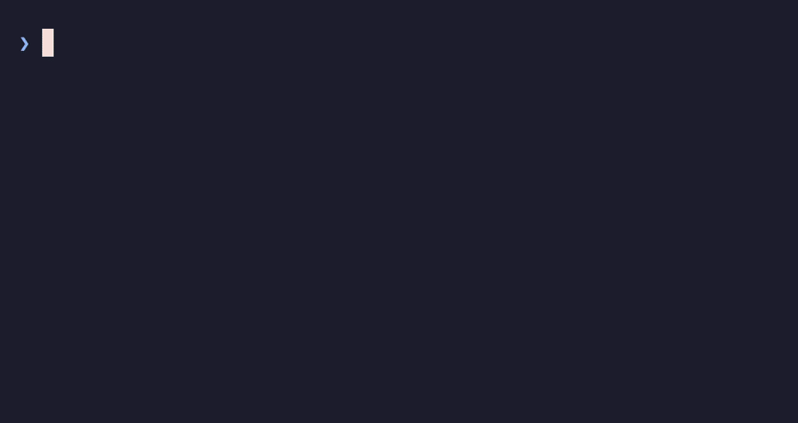

# jigger

*Ce document existe aussi en [anglais](README.md).*

**Assistance aux gestionnaires de paquets dans le terminal** — complétion contextuelle
et sélecteur interactif, dans _ton_ vrai shell.



*Prise sur macOS — rien n'est tapé d'autre que la commande elle-même. Le [même popup sur les trois plateformes](docs/fr/getting-started.md#le-même-popup-sur-les-trois),
et [comment les captures sont produites](docs/captures.md).*

`jigger` est un petit binaire Go autonome (démarrage quasi instantané) branché dans le
shell : dès que tu tapes une commande de gestionnaire de paquets, un **sélecteur**
([Bubble Tea] / [Lip Gloss]) s'affiche sous le prompt et suit ta frappe, proposant les
bons candidats selon le contexte. ⇥ insère le candidat courant dans la ligne ; tu n'as
jamais à demander.

| Plateforme | Shell | Commandes complétées |
|---|---|---|
| macOS, Linux | zsh (`shell/jigger.plugin.zsh`) | [Homebrew](https://brew.sh) |
| Arch Linux | zsh | [pacman](https://wiki.archlinux.org/title/Pacman_(Fran%C3%A7ais)), [yay](https://github.com/Jguer/yay) — les dépôts et l'[AUR](https://aur.archlinux.org) |
| Windows | PowerShell (`shell/jigger.psm1`) | [winget](https://learn.microsoft.com/windows/package-manager/), [scoop](https://scoop.sh) |
| toutes | les deux | `ssh`, `scp`, `sftp` — les serveurs de ton `~/.ssh/config` |

C'est le **premier mot de la ligne** qui décide : `brew`, `winget`, `scoop`, `pacman`,
`yay` — et `ssh`,
`scp` ou `sftp`, dont les candidats sont des serveurs et non des paquets. Chacun apporte
ses sous-commandes, ses options et son catalogue ; tout le reste — le popup, les touches,
le bloc de prompt — est commun.

jigger n'*exécute* jamais `ssh` : il complète la ligne que tu lanceras toi-même, et se
tait quand il n'a **aucun hôte à proposer** — pas de `~/.ssh/config`, ou rien qui
corresponde à ce que tu tapes : pas de popup. Ce qui est intercepté reste ton choix,
dans les deux shells, par `JIGGER_COMMANDS`
([réglages](#réglages)). Voir l'[ADR-0005](docs/adr/0005-completion-sans-facade.md) : le
contrat de complétion n'est pas réservé aux gestionnaires de paquets.

Compagnon en ligne de commande de l'app GUI **Cocktails**, mais **totalement indépendant** :
il ne requiert que le gestionnaire lui-même.

## Ce qu'il fait

- **Complétion contextuelle**
  - premier mot → sous-commandes (`install`, `uninstall`, `search`…) ;
  - après `install`, `show`, `info`… → **tous** les paquets connus ;
  - après `uninstall`, `upgrade`, `pin`… → seulement les paquets **installés** ;
  - après `-` → les **options** de la sous-commande (`winget install --exact`,
    `brew list --versions`…).
- **Un sélecteur de serveurs SSH** : tape `ssh `, `scp ` ou `sftp ` et le popup propose
  les hôtes déclarés dans `~/.ssh/config` — les `Include` sont suivis, `Host *` et les
  autres gabarits écartés —, chacun avec son `HostName` en regard. Une commande sans
  verbe place son opérande juste après son nom : le catalogue vient donc dès le premier
  mot. `scp` insère `hôte:`, deux-points collés, parce que `scp fichier hôte /tmp`
  copierait en silence vers un fichier **local** nommé `hôte`. Sur une machine sans
  `~/.ssh/config`, rien ne s'affiche du tout.
  [Le sélecteur SSH](docs/fr/ssh.md) le traite en entier.
- **Badges** et **indicateur « installé »** dans le sélecteur : ◆ pour le cas ordinaire
  (formula, paquet du catalogue winget, bucket `main`), ▣ pour l'autre (cask, application
  détectée hors catalogue, bucket tiers).
- **Corrections automatiques** — celles qui évitent une commande fautive :
  - brew : choisir un cask « pur » derrière `install`/`reinstall` insère `--cask <nom>` ;
  - scoop : un nom présent dans plusieurs buckets s'insère qualifié, `main/flux` ;
  - winget : un identifiant contenant des espaces s'insère entre guillemets.
- **Popup vivant** : le cadre apparaît dès « `winget ` » et se filtre au fil de la frappe,
  sans presser la moindre touche. `↓` fait entrer dans la liste, `⇥` insère, `⏎` complète
  et exécute d'une seule frappe, `^G` ferme.
- **Focus explicite** : le popup ne prend les flèches qu'une fois qu'on y est entré. `↓`
  l'y fait entrer, `↑` en ressort dès le premier candidat — et tant qu'il n'a pas le
  clavier, `↑`/`↓` restent l'historique du shell. La ligne courante le montre : soulignée
  quand le popup a le clavier, au repos quand il ne l'a pas.
- **Bloc de prompt** (optionnel) : version du gestionnaire et mises à jour en attente
  dans le prompt, comptées séparément — sans jamais le ralentir. Segments prêts à coller
  pour **oh-my-posh** et **starship**.

## Installation

Clé en main, un bloc à coller par plateforme : **[Installer jigger, de bout en bout](docs/fr/installation.md)**.

De bout en bout, pas à pas : **[Premiers pas](docs/fr/getting-started.md)** — installer,
brancher dans le shell, régler, dépanner. Ce qui suit en est le résumé.

```powershell
# Windows — précompilé, rien à compiler
scoop bucket add jigger https://gitlab.yg-devworks.com/yves/scoop-jigger.git
scoop install jigger
```

```sh
# ailleurs, ou pour le construire soi-même (Go ≥ 1.26)
go install gitlab.yg-devworks.com/yves/jigger@latest   # → $GOBIN/jigger
#   ou :  git clone … && make install         (Windows : install-windows.ps1)
```

Le binaire `jigger` doit être dans le `PATH`.

### zsh (Homebrew)

Par le tap, qui compile le binaire, installe le greffon et pose `brew jigger` :

```sh
brew tap yves/cocktails https://gitlab.yg-devworks.com/yves/homebrew-cocktails.git
brew install jigger
```

```sh
# dans ~/.zshrc
source "$(brew --prefix jigger)/share/jigger/jigger.plugin.zsh"
#   depuis les sources :  source /chemin/vers/jigger/shell/jigger.plugin.zsh
```

Recharge ton shell (`exec zsh`).

### PowerShell (winget, scoop)

Le bucket scoop ne pose que le **binaire** — le module vient du dépôt :

```powershell
git clone https://gitlab.yg-devworks.com/yves/jigger.git $HOME\git\jigger
```

```powershell
# dans $PROFILE  (notepad $PROFILE pour l'ouvrir)
Import-Module $HOME\git\jigger\shell\jigger.psm1
```

Recharge ton shell (`. $PROFILE`, ou un nouvel onglet). PowerShell 7 est recommandé ;
PSReadLine est requis (il est livré avec Windows).

Deux réserves, à connaître :

- le **mode Vi** de PSReadLine désactive le popup vivant (⇥ reste disponible) : relayer
  les caractères imprimables casserait la navigation en mode commande ;
- `PredictionViewStyle = ListView` dessine au même endroit que le popup. jigger range la
  vue le temps du cadre — la prédiction repasse en `InlineView`, à la suite du curseur —
  et la lui rend dès qu'il s'efface. Sans quoi les deux se disputeraient les mêmes lignes
  à chaque frappe.

## Usage

Tape simplement une commande — le popup vit tout seul :

```
winget ␣                 → les sous-commandes
winget install Git.      → les paquets « Git.… », mis à jour à chaque lettre
scoop uninstall ␣        → les applications installées
winget list --           → les options de list
brew install fire        → idem, côté macOS
```

| Touche | Effet |
|---|---|
| `⇥` | insère le candidat courant (corrigé si besoin) |
| `⏎` | complète la dernière partie **et** exécute la ligne, en une seule frappe |
| `↓` | entre dans la liste, puis descend d'un candidat |
| `↑` | remonte ; au premier candidat, rend le clavier au shell |
| `^N` / `^P` | les mêmes, pour qui les préfère aux flèches |
| `^G` | ferme le popup pour la ligne en cours (`⇥` le rouvre) |
| `^R` | bascule le filtre entre texte brut et regex ; le titre du cadre affiche `[regex]` tant que c'est actif |

`⏎` **complète, puis exécute — dans la même frappe**, et à tous les niveaux de l'arbre :
verbe, sous-verbe, option, nom de paquet. `winget li ⏎` lance `winget list` ; c'est `⇥`
qu'on n'a plus à taper. Presser `⏎`, c'est dire « pars » : la ligne part, complétée si un
candidat était désigné, telle quelle sinon — jigger ne juge pas à ta place si elle est
correcte. `^G` ferme le popup pour la ligne en cours si tu veux exécuter exactement ce que
tu as tapé.

Tant que le popup n'a pas le clavier, `↑` et `↓` sont **l'historique du shell**, popup
ouvert ou non : ouvrir une liste de candidats ne coûte pas l'accès à la commande
précédente. Ce qu'elles feront se lit dans le cadre — pied `↓ parcourir` et ligne
courante au repos tant qu'il n'a pas le focus, `↑↓ naviguer` et ligne soulignée dès
qu'il l'a. Et jigger rend toujours la touche à ce qu'elle faisait avant lui : si un autre
greffon tient déjà tes flèches (recherche par préfixe dans l'historique, par exemple),
c'est lui qui reprend la main.

`^R` bascule le **filtre**, et rien que le filtre : la ligne, le cadre et les touches ne
bougent pas. Trois choses à savoir — le motif n'est pas ancré, si bien que `fire` en mode
regex retient aussi `arrayfire` ; la casse est ignorée dans les deux modes ; et cela ne
vaut que pour les **noms de paquets**, les verbes, les sous-commandes et les options
gardant le filtre par préfixe. Un motif qui ne compile pas ne retient rien, et le cadre le
dit plutôt que d'égrener le catalogue entier. Hors du popup, `^R` reste la recherche
arrière dans l'historique de ton shell.

Après `winget install`, le mot est vide et le catalogue compte des milliers d'entrées :
le cadre invite alors à taper au moins une lettre plutôt que d'égrener la liste.

### Réglages

Identiques dans les deux shells — à poser **avant** le `source` / l'`Import-Module` :

```sh
JIGGER_LIVE=0     # désactive le popup vivant : ⇥ ouvre le sélecteur plein écran
JIGGER_ROWS=12    # candidats affichés (défaut 8 ; réduit si le terminal est court)
JIGGER_KEY='^ '   # touche d'insertion (défaut Tab)
JIGGER_LANG=fr    # langue des messages : en ou fr
JIGGER_COMMANDS='brew pacman ssh'  # commandes qui déclenchent le popup (défaut
                             # 'brew ssh scp sftp' ; jigger et jg s'y ajoutent
                             # toujours). C'est par là qu'on éteint le sélecteur SSH.
```

```powershell
$env:JIGGER_LIVE = '0'
$env:JIGGER_ROWS = '12'
$env:JIGGER_KEY  = 'Ctrl+Spacebar'   # noms de touches PSReadLine
$env:JIGGER_LANG = 'fr'              # langue des messages : en ou fr
$env:JIGGER_COMMANDS = 'winget,scoop,ssh,scp,sftp'  # commandes qui déclenchent le popup
                                                     # (jigger et jg s'y ajoutent toujours)
$env:JIGGER_KEYS_EXTRA = 'éèçàù'           # touches à relayer en plus des ASCII
```

jigger parle **anglais et français**. Sans rien lui dire, il prend la langue de `LC_ALL`,
`LC_MESSAGES`, `LANG` — puis, sous Windows, celle du système —, et retombe sur l'anglais
pour tout ce qu'il ne sait pas traduire. `JIGGER_LANG` passe avant tout cela : c'est lui
qui rend le français à un shell qui tourne en anglais. Le binaire et le greffon le lisent
de la même façon, si bien que le popup et les messages du greffon ne se contredisent
jamais.

Le popup s'efface de lui-même si le terminal est trop étroit — et, sous zsh, s'il ne
répond pas à l'interrogation de position du curseur.

Quand le prompt occupe la dernière ligne de l'écran — le cas ordinaire d'un terminal en
usage —, **jigger pousse l'écran** pour dégager la place du cadre, comme le fait
`fzf --height`. C'est vrai des deux shells : sans cela, le popup ne s'afficherait pour
ainsi dire jamais.

Chacun des deux greffons **vérifie la version du binaire** au chargement. Greffon et
binaire vont par paire : un binaire plus ancien ne connaît pas les options que le greffon
lui passe, il sort en erreur, et le popup ne s'affiche jamais — sans un mot. Il le dit
désormais.

`JIGGER_KEYS_EXTRA` mérite un mot : PSReadLine n'offre aucun crochet appelé à chaque
frappe. jigger réenregistre donc, une à une, les touches qui modifient la ligne — les
ASCII imprimables, plus celles de cette liste. Sur un clavier AZERTY, la rangée des
chiffres non pressée donne « éèçàù » : d'où le réglage, et sa valeur par défaut.

## Une seule syntaxe

Au-dessus des trois popups natifs, `jg <verbe> [paquet…]` — alias de `jigger <verbe>…`,
posé par les deux greffons — parle un seul vocabulaire aux trois gestionnaires. `jg install fd`
fait exactement ce que ferait `brew install fd` (ou `scoop install fd`, ou
`winget install --id fd --exact`) : la façade se contente de trouver, pour `fd`, quel
gestionnaire le connaît et comment le lui demander.

### Douze verbes, trois traductions

**Universels** — les trois gestionnaires savent faire :

| Verbe `jg` | brew | winget | scoop |
|---|---|---|---|
| `install {pkgs}` | `install {pkgs}` | `install --id {pkg} --exact` | `install {pkgs}` |
| `uninstall {pkgs}` | `uninstall {pkgs}` | `uninstall --id {pkg} --exact` | `uninstall {pkgs}` |
| `upgrade [pkgs]` | `upgrade [pkgs]` | `upgrade --id {pkg}` | `update {pkgs}` / `update *` |
| `list` | `list --versions` | `list` | `list` |
| `outdated` | `outdated --json=v2` | `list --upgrade-available` | lu sur le disque, sans sous-processus |
| `search {q}` | `search {q}` | `search {q}` | `search {q}` |
| `info {pkg}` | `info {pkg}` | `show --id {pkg}` | `info {pkg}` |

`{pkgs}` chez brew et scoop : une seule invocation, tous les noms dessus — `{pkg}` chez
winget : un `--id` par appel, un appel par nom. winget ne prend qu'un identifiant à la
fois ; jigger appelle donc autant de fois qu'il y a de noms qui lui reviennent, en séquence.

**Convergents** — un même concept, un nom différent chez chacun (ou chez deux sur trois) :

| Verbe `jg` | brew | winget | scoop |
|---|---|---|---|
| `source` | `tap` | `source list` | `bucket list` |
| `source add {arg}` | `tap {arg}` | `source add {arg}` | `bucket add {arg}` |
| `source rm {arg}` | `untap {arg}` | `source remove {arg}` | `bucket rm {arg}` |
| `pin {pkg}` | `pin {pkg}` | `pin add --id {pkg}` | `hold {pkg}` |
| `unpin {pkg}` | `unpin {pkg}` | `pin remove --id {pkg}` | `unhold {pkg}` |
| `cleanup` | `cleanup` | _(pas ce concept)_ | `cleanup *` |
| `doctor` | `doctor` | _(pas ce concept)_ | `checkup` |

`cleanup` et `doctor` n'existent pas chez winget : les demander avec winget pour seul
gestionnaire disponible échoue proprement, en disant qui saurait faire ça et pourquoi ce
n'est pas lui — c'est le modèle de capacités qui parle, pas une erreur muette.

> **Colonnes winget et scoop : à prendre avec précaution.** Elles viennent du cahier des
> charges et n'ont, à ce jour, jamais été vérifiées contre une vraie installation. Seule
> la colonne brew a tourné pour de vrai (`brew <verbe> --help`, une à une).
> `internal/winget/verbs.go` et `internal/scoop/verbs.go` portent le même avertissement en
> commentaire ; une passe Windows le lèvera — les captures ne sont pas cette passe : elles
> montrent le popup, pas les tables de verbes.

### Le routage : jamais de choix automatique

jigger cherche le nom demandé dans le catalogue de chaque gestionnaire disponible :

- **un seul le connaît** → il gagne, sans qu'on ait à le dire ;
- **plusieurs le connaissent** → le sélecteur s'ouvre, badges à l'appui — le même popup
  qu'à la complétion, avec un autre titre à son cadre ;
- **aucun ne le connaît** → erreur, avec les voisins les plus proches quand le catalogue
  en propose.

Il n'y a pas de quatrième cas : aucun réglage (pas de `JIGGER_PM_ORDER`) ne tranche à la
place de l'utilisateur. Deux paquets qui portent le même nom ne sont pas forcément le même
logiciel, et un arbitrage silencieux entre les deux est précisément ce qui rendrait une
façade impossible à croire.

Deux erreurs capturées pour de vrai (brew, seul gestionnaire présent sur cette machine) :

```
$ jg frobnicate
jigger : « frobnicate » — verbe inconnu. « jg ⇥ » liste ce que jigger sait faire

$ jg info zzznonexistentpkgzzz
jigger : « zzznonexistentpkgzzz » — inconnu de brew
        Si le paquet est trop récent pour le catalogue : jg … --pm brew zzznonexistentpkgzzz
```

`--pm <gestionnaire>` est l'échappatoire — pour trancher une ambiguïté hors terminal (pipe,
script, CI), atteindre un paquet trop récent pour le catalogue en cache, ou cibler un verbe
sans nom (`jg doctor --pm scoop`). Capturé pour de vrai, sur une machine qui n'a que
brew — d'où l'échec, celui d'un gestionnaire absent plutôt que celui d'une ambiguïté :

```
$ jg list --pm scoop
jigger : --pm scoop — gestionnaire indisponible pour ce verbe. Disponibles : brew
```

Sous Windows, avec winget et scoop tous deux présents, une vraie ambiguïté ouvrirait le
sélecteur (exemple illustratif : le sélecteur de routage est le seul cadre dont Windows
n'a pas encore de capture — [docs/captures.md](docs/captures.md) dit ce que couvrent ses
six scénarios) :

```
$ jg install git
┌─ git : 2 gestionnaires ──────────┐
│ ◆ Git.Git            winget      │
│ ▣ git                scoop/main  │
└─ ↵ choisir   ^G annuler ─────────┘
```

### `--json`, `--yes`

Les quatre verbes qui rendent un **tableau** — `list`, `outdated`, `search`, `source` —
acceptent `--json` pour la même donnée en machine-readable. Tout le reste (`install`,
`uninstall`, `info`…) relaie la sortie du gestionnaire **telle quelle** : invites, barres
de progression et élévation UAC fonctionnent sans une ligne de code de plus, précisément
parce que jigger ne s'interpose pas.

Capturé pour de vrai (`brew`, macOS) :

```
$ jg outdated
PAQUET         ACTUEL    DISPO
boost          1.90.0_1  1.92.0
pipx           1.16.6    1.16.7
uv             0.12.4    0.12.5
vtk            9.6.2     9.6.2_1
1password-cli  2.38.1    2.39.0
claude-code    2.1.223   2.1.224

$ jg outdated --json
[
  {
    "name": "boost",
    "version": "1.90.0_1",
    "available": "1.92.0",
    "kind": "F",
    "source": "",
    "pm": "brew"
  },
  …
]
```

Et un exemple de relais brut, sur `info` (jamais normalisé) — tronqué ici, mais chaque
ligne ci-dessous est celle qu'imprime réellement `brew info fd` :

```
$ jg info fd
==> fd: stable 10.4.2 (bottled), HEAD
Simple, fast and user-friendly alternative to find
https://github.com/sharkdp/fd
Conflicts with:
  fdclone (because both install `fd` binaries)
Not installed
…
```

`--yes` accepte les **accords de licence de winget**
(`--accept-package-agreements --accept-source-agreements`) sur `install`/`uninstall`/
`upgrade`. Il n'est **jamais implicite** : sans lui, l'invite de winget s'affiche
normalement — la sortie étant relayée, rien n'empêche d'y répondre à la main. Chez brew et
scoop, qui n'ont pas cette notion, `--yes` ne fait rien.

### Quand il faut être administrateur

**Windows.** jigger ne s'interpose toujours pas : la commande part normalement, et c'est
son **code de sortie** qui dit ce qui s'est passé. Quand winget refuse faute de droits,
jigger le dit et propose de la relancer élevée — jamais de lui-même, et jamais sans un oui
explicite (la ligne ouverte par défaut est *annuler*).

```
$ jg install Quelque.Chose
jigger (winget) : cette commande demande les privilèges d'administrateur.
╭──────────────────────────────────────────────────────────╮
│❯ Relancer en administrateur ?               jigger 0.20.0│
│  •  annuler                                              │
│  •  relancer dans une fenêtre élevée                     │
│                                                          │
│   ↵  choisir   ^G  annuler                               │
╰──────────────────────────────────────────────────────────╯
```

Trois choses valent d'être sues :

- **Deux des codes de winget disent l'inverse** — l'installeur qui *refuse* un contexte
  élevé, l'action interdite en administrateur sur un paquet installé pour l'utilisateur.
  jigger ne propose rien sur ceux-là : il dit de réessayer depuis un terminal ordinaire.
- **Par où ça passe est annoncé avant que tu répondes.** Si le `sudo` de Windows 11 est
  activé (Paramètres → Système → Pour les développeurs), jigger l'emploie ; sinon il ouvre
  une console élevée séparée — un processus élevé ne peut pas s'attacher à la console d'un
  processus qui ne l'est pas, c'est une frontière du système. Dans les deux cas, jigger
  attend la fin et rend le code là où tu as tapé.
- **Sans terminal, aucune question.** `jg install … | tee`, un script, une tâche
  planifiée : jigger imprime la ligne exacte à relancer et rend le code d'origine. Un
  pipeline ne se bloque jamais sur une invite.

Le raisonnement est dans [l'ADR-0004](docs/adr/0004-elevation-constatee.md) : jigger
constate, il n'intercepte pas. **macOS et Linux** ne sont pas concernés — aucun
gestionnaire n'y publie de code de sortie équivalent (A-22).

### La colonne PM

```
$ jg source
PAQUET                     ACTUEL
asmvik/formulae
felixkratz/formulae
jandedobbeleer/oh-my-posh
koekeishiya/formulae
nikitabobko/tap
yves/cocktails
```

(capturé pour de vrai — les taps réellement configurés sur cette machine ; `list` ci-dessus
et `outdated` plus haut sont dans le même cas.) La colonne `PM` ne s'affiche que si
**plusieurs** gestionnaires ont contribué à un tableau — une colonne toujours identique
n'apprend rien. Sur cette machine, brew seul répond : pas de colonne PM. Avec winget et
scoop tous deux présents, `jg outdated` afficherait une troisième colonne distinguant les
deux origines.

### Ce que la façade ne change pas

Les commandes natives — `brew install fd`, `winget search Git`, `scoop info 7zip` —
continuent de marcher exactement comme avant, popup vivant compris : la façade **s'ajoute**,
elle ne remplace rien. `jg`/`jigger` est un chemin de plus, pas un chemin obligé.

**Ce qui n'est pas encore là :**

- Les colonnes winget et scoop de la table ci-dessus restent **non vérifiées en pratique**
  (cf. l'avertissement plus haut) — seule brew a tourné pour de vrai.

## Bloc de prompt

Un bloc dans le prompt : la **version du gestionnaire**, et les **mises à jour en
attente**, comptées séparément. Prêt à coller pour **oh-my-posh** et pour **starship** ;
tout passe par des variables d'environnement, donc n'importe quel autre prompt sait les
lire.

```
 yves@MacBook  ~/git/jigger   main  🍺 6.0.17  🔬 7  📦 2 ❯      ← macOS
 PS D:\jigger  💻 1.29.280  📦 48  🥄 1 ❯                        ← Windows
```

Sur macOS : une **bière** pour brew, un **microscope** pour les formulae, un **colis**
pour les casks. Sous Windows : un **portable** pour la version de winget, un **colis**
pour les paquets winget à mettre à niveau, une **cuillère** pour les applications scoop.

Chaque compteur disparaît quand il tombe à zéro — `💻 1.29.280  🥄 1` s'il ne reste que
scoop, `💻 1.29.280` tout court quand tout est à jour. Un compteur ne s'affichant **jamais**
à zéro, sa seule présence signifie « à mettre à jour » : ni flèche ni lettre à ajouter.

Ce sont des **émojis** : aucune police particulière n'est requise. Le choix n'est pourtant
pas libre. Le `wcwidth()` de macOS ignore la largeur des émojis postérieurs à Unicode 8 et la
rend nulle : zsh compte alors zéro colonne là où le terminal en dessine deux, son calcul de
curseur se décale, et la ligne de commande perd un caractère **à l'affichage** dès qu'elle
atteint le bord droit. Le tampon, lui, reste intact — la commande exécutée est la bonne, ce
qui rend la panne d'autant plus déroutante. L'éprouvette `\U0001F9EA` et la fenêtre
`\U0001FA9F` étaient dans ce cas, et ont été remplacées. Le piège symétrique existe aussi :
les glyphes à **présentation texte** par défaut, comme `\U0001F5A5` (écran) ou `\U0001F6E0`
(marteau et clé), que zsh compte pour deux colonnes et que le terminal dessine sur une.

Avant de poser un autre émoji, le vérifier : `${(m)#c}` sous zsh doit valoir ce que le
terminal dessine. Sur macOS 25.5, 848 des 1171 glyphes larges passent ce test. Pour esquiver
la question, chaque fichier de segment indique les glyphes **Nerd Font** correspondants, de
largeur 1 et jamais ambiguë.

Dans les deux cas, écris-les en **échappements** (`\u21E1`, `\U0001F37A`) plutôt qu'en
clair : c'est la seule forme qui traverse sans dommage les éditeurs, les copier-coller et
les outils qui normalisent l'Unicode. JSON et TOML l'acceptent tous deux, et les thèmes
livrés par oh-my-posh font de même.

Compter les mises à jour coûte de une à cinq secondes — `brew outdated` comme
`winget list --upgrade-available` : c'est donc **exclu du chemin du prompt**. jigger le
lance en tâche de fond et dépose le résultat dans un fichier d'une ligne, que le hook
relit avec les seules primitives du shell — **aucun processus lancé, aucune attente**. La
valeur affichée est celle du dernier calcul ; passé `JIGGER_PROMPT_TTL`, un
rafraîchissement part détaché et le prompt suivant est à jour.

Ce TTL seul laisserait le compteur mentir une demi-heure après un `winget upgrade`. jigger
repère donc les commandes qui changent l'état — `install`, `upgrade`, `uninstall`,
`update`, `bucket`… — au moment où elles partent, et rafraîchit **dans la foulée** : le
prompt qui suit l'upgrade est déjà juste. C'est la seule fois où le prompt attend quelque
chose (moins d'une seconde en général, après une commande qui a duré bien plus) ;
`JIGGER_PROMPT_SYNC=0` rend ce rafraîchissement détaché, au prix d'un compteur juste au
prompt d'*après*.

Seul ce que le shell voit passer est détecté : une mise à jour lancée ailleurs — autre
onglet, application graphique — reste rattrapée par le TTL.

Tout passe par des **variables d'environnement** : oh-my-posh n'a plus de segment
`command` depuis la v26, et faire lancer un processus à starship à chaque prompt irait
contre la règle ci-dessus. Le hook exporte, le prompt lit — un segment `text` côté
oh-my-posh, des modules `env_var` côté starship.

**1. Activer le hook** — *avant* le chargement du greffon :

```sh
JIGGER_PROMPT=1                                    # ~/.zshrc
source /chemin/vers/jigger/shell/jigger.plugin.zsh
```

```powershell
$env:JIGGER_PROMPT = '1'                           # $PROFILE
Import-Module $HOME\git\jigger\shell\jigger.psm1
```

Sous PowerShell, `prompt` est le seul « precmd » disponible : jigger **enveloppe** celui
qui est en place. Importe donc jigger **après** oh-my-posh ou starship, sans quoi le bloc
aurait toujours un coup de retard. (Sous zsh, l'ordre des `source` n'a pas d'importance :
le hook se place de lui-même en tête de `precmd_functions`, donc avant que le prompt ne
soit rendu.)

**2a. Le segment oh-my-posh** — les thèmes livrés avec oh-my-posh sont écrasés à chaque
mise à jour : travaille sur une copie.

```sh
mkdir -p ~/.config/oh-my-posh
cp "$(brew --prefix oh-my-posh)/themes/catppuccin_mocha.omp.json" \
   ~/.config/oh-my-posh/mon-theme.omp.json
```

Colle le contenu de [`shell/oh-my-posh/brew.segment.json`](shell/oh-my-posh/brew.segment.json)
— ou de [`pacman.segment.json`](shell/oh-my-posh/pacman.segment.json) ou de
[`windows.segment.json`](shell/oh-my-posh/windows.segment.json) — dans le tableau
`segments` du bloc voulu, puis fais pointer ton profil sur ta copie :

```sh
eval "$(oh-my-posh init zsh --config ~/.config/oh-my-posh/mon-theme.omp.json)"
```

**2b. Le segment starship** — rien à copier au préalable : starship n'a qu'un fichier de
configuration, le tien. Ajoute à la fin de `~/.config/starship.toml` le contenu de
[`shell/starship/brew.toml`](shell/starship/brew.toml) — ou de
[`pacman.toml`](shell/starship/pacman.toml) ou de
[`windows.toml`](shell/starship/windows.toml) :

```sh
cat /chemin/vers/jigger/shell/starship/brew.toml >> ~/.config/starship.toml
```

Ce sont trois modules [`env_var`](https://starship.rs/config/#environment-variable), un
par variable. Le `format` par défaut de starship (`$all`) contient déjà `$env_var` : le
bloc apparaît sans rien de plus. Pour le placer ailleurs, écris un `format` explicite et
pose-y `${env_var}` — ou, module par module, `${env_var.JIGGER_BREW_VERSION}`.

Là où le segment oh-my-posh suspend tout le bloc à la version du gestionnaire, les trois
modules starship sont indépendants : sur une machine qui n'a que scoop, `🥄 1` s'affiche
seul plutôt que rien.

Le bloc n'affiche **rien** tant que le cache n'existe pas — il apparaît au deuxième
prompt, une fois le premier rafraîchissement terminé.

### Réglages

```sh
JIGGER_PROMPT=1        # active le bloc (défaut 0)
JIGGER_PROMPT_TTL=1800 # âge du cache, en secondes, avant rafraîchissement (défaut 30 min)
JIGGER_PROMPT_SYNC=1   # après une commande mutante, rafraîchir avant d'afficher le
                       # prompt (défaut) ; 0 = détaché, juste au prompt suivant
JIGGER_CACHE_DIR=…     # emplacement du cache (défaut ~/Library/Caches/jigger sur macOS,
                       # %LOCALAPPDATA%\jigger sous Windows)
```

### Variables exposées

| Variable | Contenu |
|---|---|
| `JIGGER_BREW_VERSION` | version de brew, sans suffixe de commits : `6.0.17` |
| `JIGGER_BREW_FORMULAE` | formulae obsolètes |
| `JIGGER_BREW_CASKS` | casks obsolètes |
| `JIGGER_BREW_OUTDATED` | total des deux |
| `JIGGER_WINGET_VERSION` | version de winget : `1.29.280` |
| `JIGGER_WINGET_OUTDATED` | paquets winget à mettre à niveau |
| `JIGGER_SCOOP_OUTDATED` | applications scoop à mettre à niveau |
| `JIGGER_PACMAN_VERSION` | version de pacman : `7.1.0` |
| `JIGGER_PACMAN_REPOS` | paquets des dépôts à mettre à niveau |
| `JIGGER_PACMAN_AUR` | paquets de l'AUR à mettre à niveau |
| `JIGGER_PACMAN_OUTDATED` | total des deux |
| `JIGGER_OUTDATED` | total des deux |

Un compteur **n'est pas défini** quand il vaut zéro. Côté oh-my-posh, le template se
réduit ainsi à un `{{ if .Env.JIGGER_WINGET_OUTDATED }}`, sans comparaison de chaînes ;
côté starship, un module `env_var` sans variable ne s'affiche pas, et il n'y a aucune
condition à écrire. Des deux côtés, le bloc s'efface tout seul quand il n'y a rien à dire.

Pour n'afficher qu'un chiffre plutôt que le détail par gestionnaire, remplace les deux
blocs du template oh-my-posh par :

```
{{ if .Env.JIGGER_OUTDATED }} <#F9E2AF>\u21e1{{ .Env.JIGGER_OUTDATED }}</>{{ end }}
```

… ou les deux derniers modules starship par :

```toml
[env_var.JIGGER_OUTDATED]
symbol = "\u21E1 "
style  = "#F9E2AF"
format = "[$symbol$env_value]($style) "
```

Rien n'interdit de se servir de ces variables ailleurs que dans ces deux prompts (un
prompt maison, un `PS1` bricolé…). Sous PowerShell, `Update-JiggerPrompt` est exportée
exprès : appelle-la depuis ta propre fonction `prompt`.

## Sous le capot (CLI)

Le greffon s'appuie sur ces sous-commandes ; utilisables seules :

```sh
jigger <verbe> [--pm <gestionnaire>] [--json] [--yes] [arguments…]
                                 # la façade, cf. § Une seule syntaxe — install, uninstall,
                                 # upgrade, list, outdated, search, info, source[ add|rm],
                                 # pin, unpin, cleanup, doctor
jigger render --line "winget install Git." --sel 0 --cols 80   # une frame du popup vivant
                                 # 1re ligne : count=… sel=… exec=… left=<ligne complétée>
                                 # --focus=true : le popup a le clavier (cf. § Usage)
jigger complete "install fire"   # candidats, un par ligne (complétion classique)
jigger pick "scoop uninstall 7z" # sélecteur interactif ; imprime la nouvelle ligne
                                 # code retour : 0 = insérer, 10 = exécuter, 2 = annulé
jigger demo                      # aperçu statique coloré du sélecteur
jigger prompt                    # état en cache : version⇥compteur1⇥compteur2⇥epoch
jigger prompt --refresh          # interroge le gestionnaire et réécrit le cache (lent)
jigger prompt --path             # chemin du fichier de cache
jigger warm                      # reconstitue les catalogues périmés (lent, détaché)
jigger warm --installed          # les seules listes de paquets installés
jigger warm --all                # tout, périmé ou non
```

`render`, `complete`, `pick`, `prompt`, `warm` et `demo` sont des **mots réservés** : le
premier mot de la ligne est un verbe de façade dès qu'il n'en fait pas partie. Contrainte
permanente pour la suite — aucun futur usage interne ne pourra reprendre le nom d'un verbe
canonique ; s'il fallait un jour un « jigger list » interne, c'est lui qui changerait de
nom, pas le verbe.

`render` est **sans état** : l'index sélectionné vit côté shell et lui revient par
`--sel`. C'est ce qui permet au greffon de rester maître du clavier — le shell garde sa
ligne, jigger ne fait qu'imprimer un cadre.

**Rien de lent n'est jamais dans le chemin d'un rendu** (~8 ms de travail, ~30 ms de bout
en bout sous Windows, où démarrer un processus coûte le plus cher). Chaque gestionnaire y
parvient à sa façon :

| | catalogue | installés | obsolètes |
|---|---|---|---|
| **brew** | `brew formulae` / `casks`, en cache 24 h | lus dans `Cellar`/`Caskroom` (~1 ms) | `brew outdated --json=v2`, en tâche de fond |
| **scoop** | lu dans `buckets/*/bucket/*.json` | lus dans `apps/<nom>/<version>` | comparaison des manifestes, sur le disque |
| **winget** | `winget search .`, en cache 24 h | `winget list`, en cache 10 min | `winget list --upgrade-available`, en tâche de fond |

scoop n'a besoin d'**aucun cache** : tout ce que jigger lui demande est déjà sur le
disque, dans une arborescence qui ressemble à s'y méprendre au `Cellar` de Homebrew. Même
le compte des mises à jour en attente s'y lit — c'est ce que fait `scoop status`, mais
sans démarrer PowerShell ni toucher au réseau.

winget est à l'opposé : aucune sortie machine (que des tableaux de largeur fixe, aux
en-têtes **traduits** — d'où un découpage aux frontières de colonnes, et des jeux d'essai
en français), et près de deux secondes par appel. Ses deux listes sont donc tenues en
cache et reconstituées par `jigger warm`, que `render` lance détaché dès qu'il les trouve
périmées. Le catalogue s'obtient en cherchant `.` : le point qui sépare l'éditeur du
paquet dans tous les identifiants de la source officielle (`Git.Git`,
`Microsoft.PowerShell`) — soit, ici, 14 401 noms.

## Tests

```sh
make test-all     # tests Go + suite du shell de la plateforme
```

Le widget zsh ne se teste que dans un vrai pseudo-terminal : `tests/zpty.zsh` lance un zsh
interactif sous `zpty`, tape une séquence de touches et vérifie ce qui est réellement
écrit à l'écran. `JIGGER_TEST_PLUGINS=1` y ajoute zsh-autosuggestions et
zsh-syntax-highlighting, pour prouver qu'ils cohabitent.

Sous Windows, `tests/conpty` joue le même rôle : il lance un pwsh dans un **pseudo-terminal**
(ConPTY), tape une séquence de touches et **rend l'écran** tel qu'on le verrait, cadre
compris. `tests/pty.ps1` (`make test-pty`) en tire ses assertions, dans la situation qui
compte — prompt sur la dernière ligne de l'écran, comme dans un terminal en usage.

```sh
go run ./tests/conpty -rc essai.ps1 -keys 'winget ins\t' -screen   # l'écran final
```

`tests/smoke.ps1` couvre ce qui ne demande pas de console : les touches effectivement
reprises, l'analyse de la sortie de `render`, les séquences d'affichage et d'effacement,
la détection des commandes mutantes, et l'export des variables du prompt depuis un cache
fabriqué.

Cette suite-là tourne **aussi sur le pwsh de macOS ou de Linux** :

```sh
go build -o jigger . && pwsh -NoProfile -File tests/smoke.ps1
```

Le module PowerShell se développe donc dans la même boucle que le reste, sans démarrer une
machine Windows — laquelle reste indispensable pour le popup à l'écran (`tests/conpty`) et
pour tout ce qui passe par les vraies CLI winget et scoop. `GOOS=windows go build` et
`GOOS=windows go vet ./...` vérifient au passage, depuis n'importe quelle plateforme, que
le code Windows compile.

## Feuille de route

- **Vérifier les colonnes winget et scoop** de la table de verbes contre les vraies CLI
  (`internal/winget/verbs.go`, `internal/scoop/verbs.go`) — écrites de mémoire, jamais
  confrontées à une machine Windows.
- Complétion **fish** et **bash**.
- Wrapper de commande : proposer d'**enchaîner** sur les commandes suggérées par le
  gestionnaire (« To install …, run: … »).
- Volet d'aperçu (`brew desc`, `winget show`) dans le sélecteur **et** dans `jg search` /
  `jg info`.
- Un paquet **winget**. Le tap Homebrew et le bucket scoop existent ; la soumission à
  winget est une autre affaire, et elle n'est pas commencée.

Non-buts assumés de la phase 1 de la façade — écartés en connaissance de cause, pas
oubliés :

- **Les verbes singuliers** (`brew services`, `winget export`, `scoop reset`…) — une ligne
  de table chacun, le jour où l'un vient à manquer.
- **Le départage automatique** (un `JIGGER_PM_ORDER` qui choisirait pour toi entre deux
  gestionnaires qui connaissent le même nom) — un arbitrage silencieux entre deux `git` qui
  ne sont pas le même logiciel romprait la confiance dans la façade. `--pm` reste la seule
  échappatoire.
- **Les gestionnaires tiers par sous-processus** (apt, pacman… branchés sans recompiler) —
  mérite son propre ADR.
- **De nouveaux gestionnaires** eux-mêmes — la phase 1 prouve le mécanisme sur trois, pas
  sur cinq.

## Contribuer

Les rapports de bogue sont bienvenus sur le miroir GitHub comme sur GitLab ; le code, lui,
passe par GitLab, seule source de vérité. [CONTRIBUTING.md](CONTRIBUTING.md) explique
pourquoi, et ce que le code attend. Pour une faille, écrivez à l'adresse de
[SECURITY.md](SECURITY.md) plutôt que d'ouvrir une issue publique.

## Licence

Apache-2.0.

[Bubble Tea]: https://github.com/charmbracelet/bubbletea
[Lip Gloss]: https://github.com/charmbracelet/lipgloss
