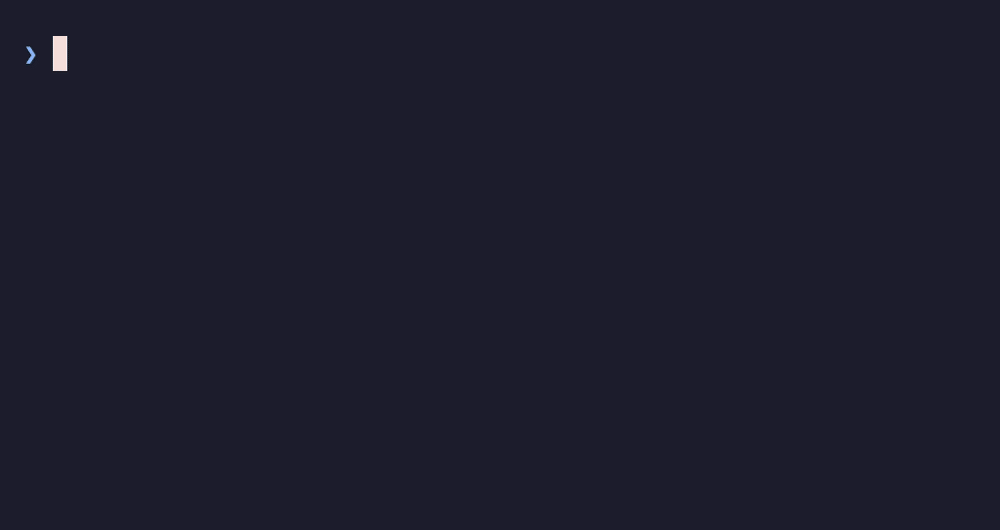
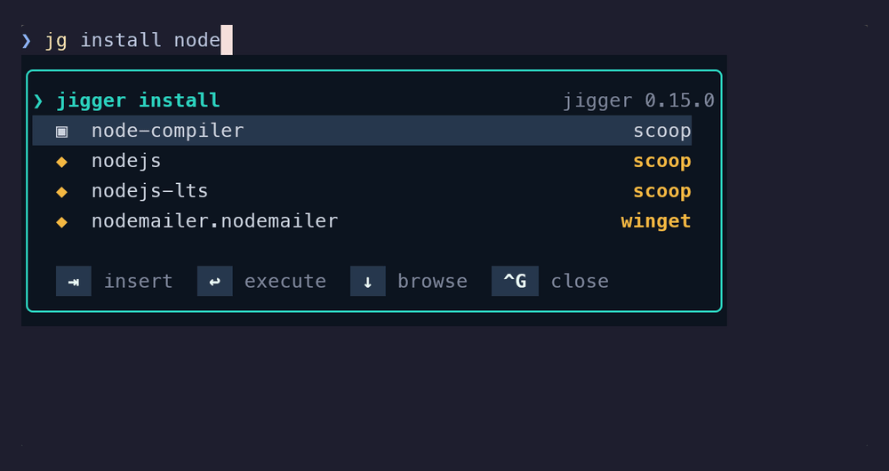

# Premiers pas avec jigger

*Ce document existe aussi en [anglais](../getting-started.md).*

De l'installation à la première complétion, en une dizaine de minutes. Ce document se lit
d'un bout à l'autre ; le [README](../../README.fr.md) reprend chaque point en détail, et explique
_pourquoi_ les choses sont faites ainsi.

`jigger` branche un sélecteur de paquets dans ton shell : dès que tu tapes une commande de
gestionnaire de paquets, un cadre s'affiche sous le prompt et suit ta frappe.

```
❯ brew install fire
╭──────────────────────────────────────────────────────────╮
│❯ brew install                               jigger 0.19.0│
│  ▣  firealpaca                                           │
│  ▣  firebase-admin                                       │
│  ◆  firebase-cli                                         │
│  ▣  firebird-emu                                         │
│  ▣  firecamp                                             │
│                                                          │
│   ⇥  insérer   ↩  exécuter   ↓  parcourir   ^G  fermer   │
╰──────────────────────────────────────────────────────────╯
```

Ou, tel qu'il se comporte réellement — rien n'est pressé, la liste se resserre à chaque
lettre :


Et, par-dessus tous les gestionnaires, **une seule syntaxe** : `jg install fd` s'adresse à
celui qui connaît `fd`, sans que tu aies à savoir lequel (§ 6).

| Plateforme | Shell | Commandes complétées |
|---|---|---|
| macOS, Linux | zsh | [Homebrew](https://brew.sh) |
| Arch Linux | zsh | [pacman](https://wiki.archlinux.org/title/Pacman), [yay](https://github.com/Jguer/yay) — dépôts et [AUR](https://aur.archlinux.org) |
| Windows | PowerShell 7 | [winget](https://learn.microsoft.com/windows/package-manager/), [scoop](https://scoop.sh) |
| toutes | les deux | `ssh`, `scp`, `sftp` — les serveurs de ton `~/.ssh/config` |

Cette dernière ligne n'est pas un gestionnaire de paquets, et jigger ne l'exécute jamais :
taper `ssh ` propose les hôtes déclarés dans `~/.ssh/config`, chacun avec son `HostName`
en regard, et ⇥ insère celui qu'on vise. `scp` insère `hôte:`, deux-points collés. Sur une
machine sans `~/.ssh/config`, rien ne s'affiche du tout ; `JIGGER_COMMANDS` (§ 7) décide
de ce qui est intercepté.



[Le sélecteur SSH](ssh.md) le traite en entier — les `Include`, les motifs qu'il écarte,
et le deux-points que reçoit `scp`.

## 1. Prérequis

- **Le gestionnaire lui-même** — et rien d'autre. jigger ne dépend d'aucun service, ne
  parle à aucun réseau, et se contente de ce que `brew`, `pacman`, `yay`, `winget` ou
  `scoop` a déjà sur le disque. Sous Arch, ce sont les bases de synchronisation que pacman
  a déjà téléchargées et le cache AUR de yay : jigger ne va jamais au réseau à leur place.
- **zsh** (livré avec macOS, et posé sur la plupart des Arch) ou **PowerShell 7** avec
  PSReadLine (livré avec Windows).
- **Go ≥ 1.26**, uniquement pour compiler — le paquet Homebrew s'en charge tout seul, et le
  bucket scoop livre un binaire précompilé. Sous Arch il n'y a ni l'un ni l'autre : Go y est
  réellement nécessaire (§ 2).

## 2. Installer le binaire

> **Pressé ?** [Installer jigger, de bout en bout](installation.md) donne la même chose en
> un seul bloc à coller par plateforme, sans rien à lire entre les lignes.

### macOS et Linux — par Homebrew (recommandé)

Le tap est hébergé sur le GitLab du projet, d'où l'URL explicite :

```sh
brew tap yves/cocktails https://gitlab.yg-devworks.com/yves/homebrew-cocktails.git
brew install jigger
```

La formule compile le binaire chez toi (`go` est tiré comme dépendance de compilation),
installe le greffon zsh sous `share/`, et pose au passage `brew-jigger` — ce qui rend
`brew jigger …` utilisable comme n'importe quelle commande brew.

Mise à jour, ensuite : `brew upgrade jigger`.

### Arch Linux — par Go, ou depuis les sources

Il n'existe **aucun paquet jigger** dans les dépôts ni dans l'AUR, et Homebrew n'est pas la
porte d'entrée ici : prends la [route Go](#toutes-plateformes--par-go) ou celle des
[sources](#depuis-les-sources), plus bas. Les deux se font en quelques secondes — `go` est à
un `pacman -S go` — et jigger n'a aucune dépendance d'exécution en dehors de pacman et yay.

Le greffon vient alors de là où tu as posé le dépôt. Les chemins en
`$(brew --prefix jigger)` du § 3 n'ont pas d'équivalent sous Arch : fais pointer le `source`
sur le clone.

### Windows — par scoop (recommandé)

Depuis la v0.10.0, les releases portent des binaires précompilés, et un bucket
[scoop](https://scoop.sh) pointe dessus. Rien à compiler, pas de Go à installer :

```powershell
scoop bucket add jigger https://gitlab.yg-devworks.com/yves/scoop-jigger.git
scoop install jigger
```

`scoop bucket add` prend **deux** arguments : le nom local que tu choisis, puis le dépôt.
N'en passer qu'un fait chercher à scoop un bucket de son propre annuaire, et il répond
`unknown bucket`.

Pour monter de version ensuite : `scoop update jigger`.

Le bucket n'installe que le **binaire**. Le greffon PowerShell — ce qui fait apparaître le
popup pendant la frappe — vient du dépôt ; le § 3 le branche.

### Toutes plateformes — par Go

```sh
go install gitlab.yg-devworks.com/yves/jigger@latest
```

Le binaire atterrit dans `$GOBIN` (à défaut `~/go/bin`, ou `%USERPROFILE%\go\bin` sous
Windows). Vérifie que ce répertoire est dans ton `PATH`.

### Depuis les sources

```sh
git clone https://gitlab.yg-devworks.com/yves/jigger.git
cd jigger
make install            # → ~/.local/bin/jigger  (PREFIX=… pour changer)
```

Sous **Windows**, passe par le script — `make install` y appelle `install(1)`, un outil
POSIX que Windows n'a pas, et `make` lui-même n'y est pas livré :

```powershell
pwsh -NoProfile -File install-windows.ps1
```

Il compile, puis met `jigger` à portée : un **shim scoop** si scoop est là — le shim
pointe sur le binaire **du dépôt**, si bien qu'un simple `go build` suffit ensuite à mettre
à jour ce que `jigger` exécute, ce qu'on veut pour développer — ou une **copie** dans
`%USERPROFILE%\bin`, ajoutée au `PATH` de l'utilisateur, sinon. `-Methode`, `-Prefixe`,
`-Profil` et `-Simuler` permettent de choisir ou de prévisualiser.

C'est la voie pour **développer** jigger, ou pour faire tourner une version pas encore
publiée. Pour simplement l'utiliser, le bucket scoop ci-dessus demande moins de travail.
Il n'existe toujours pas de paquet winget. Dans les deux cas, le greffon PowerShell est
celui du dépôt cloné.

> **Un seul binaire dans le `PATH`.** Si tu as installé par plusieurs voies, `which -a
> jigger` (ou `Get-Command jigger -All`) le dira. Un binaire ancien devant un greffon
> récent est la panne la plus pénible à diagnostiquer — d'où la vérification du § 4.

## 3. Brancher le greffon dans le shell

### zsh

```sh
# dans ~/.zshrc — installé par le tap Homebrew
source "$(brew --prefix jigger)/share/jigger/jigger.plugin.zsh"
```

```sh
# dans ~/.zshrc — depuis un clone, la route sous Arch
source ~/git/jigger/shell/jigger.plugin.zsh
```

Puis recharge : `exec zsh`.

Une seule ligne couvre tous les gestionnaires de la machine : le greffon n'a pas à savoir
d'avance s'il a affaire à brew ou à pacman, il regarde.

L'ordre des `source` dans `~/.zshrc` n'a aucune importance — le greffon se place lui-même
là où il faut dans les hooks de zsh.

### PowerShell

**Le bucket scoop ne pose que le binaire.** Le module — la partie qui dessine le cadre —
vit dans le dépôt : il faut donc le cloner d'abord. Cette étape n'a pas d'équivalent sous
macOS, où Homebrew pose le greffon à côté du binaire.

```powershell
git clone https://gitlab.yg-devworks.com/yves/jigger.git $HOME\git\jigger
```

Puis, dans ton profil :

```powershell
# dans $PROFILE   (notepad $PROFILE pour l'ouvrir)
Import-Module $HOME\git\jigger\shell\jigger.psm1
```

Puis recharge : `. $PROFILE`, ou ouvre un nouvel onglet.

Une seule contrainte d'ordre, celle-ci réelle : si tu utilises oh-my-posh ou starship,
importe jigger **après** lui (cf. § 8).

Et une chose à savoir sur les touches : PSReadLine ne garde que le **dernier** relais lié
à un raccourci. Un profil qui lie `^R` après l'import — une recherche d'historique via
fzf, typiquement — reprend la touche, et la bascule regex devient injoignable.
Propose-la-lui d'abord : elle dit elle-même si elle la veut.

```powershell
Set-PSReadLineKeyHandler -Chord Ctrl+r -ScriptBlock {
    # $true sur une ligne winget/scoop : le popup est passé en regex. $false partout
    # ailleurs — rien n'a été touché, la touche est à toi.
    if (Invoke-JiggerRegex) { return }
    Invoke-FzfHistory
}
```

Le module ne peut pas s'en charger seul : d'un relais écrit en bloc de script, PSReadLine
ne rend que la description, jamais le bloc — jigger n'a aucun moyen d'appeler le tien.
Côté zsh, où `bindkey` rend le nom du widget, le greffon relève `^R` avant de le prendre
et le lui rend de lui-même : rien à faire.

Il en va de même des touches qui prennent l'écran puis rendent la ligne — un explorateur
de fichiers sur `^U`, un sélecteur de lecteur sur `^D`. Leur relais remplace le nôtre tout
autant, et le cadre reste derrière, périmé ou orphelin. `Update-JiggerPopup` le remet
d'accord avec la ligne :

```powershell
Set-PSReadLineKeyHandler -Chord Ctrl+u -ScriptBlock {
    yazi
    [Microsoft.PowerShell.PSConsoleReadLine]::InvokePrompt()
    Update-JiggerPopup
}
```

Elle s'appelle sans la moindre précaution : hors ligne de gestionnaire, elle efface le
cadre et rend la main, et elle ne lève jamais — une frappe n'a pas le droit de barrer
l'écran de rouge. Les relais qui finissent sur `AcceptLine()` la veulent aussi, juste
avant cet appel : sinon la sortie de la commande coupe le cadre en deux.

## 4. Vérifier que ça marche

```sh
jigger --version        # → jigger 0.19.0, ou plus récent
```

Ouvre un shell neuf et tape `brew ins` (`pacman ins` sous Arch, `winget ins` sous Windows)
**sans valider**. Le cadre doit apparaître sous le prompt et se filtrer à chaque lettre.

Rien ne s'affiche ? Le greffon le dit quand il refuse de se charger : un message, au
démarrage du shell, signale que le binaire est introuvable dans le `PATH` — ou qu'il est
trop ancien pour ce greffon. Les deux vont par paire : un binaire en retard ne comprend pas
les options que le greffon lui passe, et le popup ne s'afficherait jamais, sans un mot. Si
aucun message n'apparaît, va au § 9.

**À la toute première utilisation**, le cadre peut annoncer « catalogue en préparation… » :
jigger ne fait jamais attendre une frappe après le gestionnaire de paquets, il constitue
donc son catalogue en tâche de fond. Quelques secondes plus tard, il est là — et il le
reste (cache de 24 h, renouvelé tout seul).

## 5. Utiliser

Tape simplement une commande. Le popup vit tout seul :

```
brew install fire         les paquets « fire… », mis à jour à chaque lettre
brew uninstall ␣          seulement les paquets installés
brew list --              les options de list
pacman -S ripg            idem sous Arch : c'est le drapeau qui fait office de verbe
pacman -R rip             -R, -Rns… → seulement les paquets installés
pacman -Q --              les options de -Q
yay -S visual             les dépôts *et* l'AUR, dans une seule liste
winget install Git.       idem, côté Windows
scoop uninstall 7z
```

### Le même popup, sur les trois

Un cadre, un jeu de touches, trois catalogues. Ce qui change d'une image à l'autre, c'est
le gestionnaire qui répond — rien d'autre. Les trois sont prises dans le même décor, et
[la façon de les prendre](../captures.md) est écrite.

**macOS — `brew install fire`**


**Omarchy — `yay -S visual-studio`**


**Windows — `winget install fire`**


Le même cadre, les mêmes touches, les mêmes 1000 × 530 px — et un autre catalogue : ce
sont des identifiants winget, `Éditeur.Paquet`, là où brew montre des noms de formules
nus. Rien d'autre n'a bougé.

L'image du milieu est celle qui porte deux catalogues dans une seule liste : sous Arch,
`yay` répond pour les dépôts **et** pour l'AUR, et c'est la colonne des badges qui les
distingue. ◆ est un paquet de dépôt — avec sa version, et le ● qui dit qu'il est déjà installé —,
▣ un paquet de l'AUR. ⇥ sur la première ligne insère
`yay -S omarchy/visual-studio-code-bin`, **qualifié** : ce nom est porté par un dépôt
*et* par l'AUR, et un `yay -S` non qualifié s'arrêterait pour demander lequel.

| Touche | Effet |
|---|---|
| `⇥` | insère le candidat courant |
| `⏎` | complète la dernière partie **et** exécute la ligne, en une seule frappe |
| `↓` | entre dans la liste, puis descend d'un candidat |
| `↑` | remonte ; au premier candidat, rend le clavier au shell |
| `^N` / `^P` | les mêmes, pour qui les préfère aux flèches |
| `^G` | ferme le popup pour la ligne en cours (`⇥` le rouvre) |
| `^R` | bascule le filtre entre texte brut et expression rationnelle. Le titre du cadre affiche `[regex]` tant que c'est actif, et la touche retourne à la recherche inverse du shell dès que le popup n'est pas là. Sous PowerShell, un profil qui lie `^R` après l'import la reprend — cf. § 3 |

Trois choses à savoir, qui font l'essentiel du confort :

- **`⏎` complète, puis exécute — dans la même frappe.** `winget li ⏎` lance
  `winget list` : c'est `⇥` qu'on n'a plus à taper, et cela vaut à tous les niveaux —
  verbe, sous-verbe, option, nom de paquet. Presser `⏎`, c'est dire « pars » : la ligne
  part, complétée si un candidat était désigné, telle quelle sinon. `^G` ferme le popup
  pour la ligne en cours si tu veux exécuter exactement ce que tu as tapé.
- **Les flèches restent ton historique** tant que le popup n'a pas le clavier — popup
  ouvert ou non. Le cadre le montre : ligne courante soulignée et pied `↑↓ naviguer` quand
  il a le focus, au repos et `↓ parcourir` quand il ne l'a pas.
- **jigger corrige ce qu'il insère** quand la commande serait fautive sans cela : `--cask`
  ajouté devant un cask Homebrew, nom qualifié `main/flux` pour un paquet scoop présent
  dans plusieurs buckets, `extra/rustup` pour un nom que portent à la fois un dépôt Arch et
  l'AUR — sans quoi `yay -S rustup` s'arrêterait pour demander lequel, au milieu de ce que
  jigger vient d'insérer —, guillemets autour d'un identifiant winget à espaces.

Les badges devant les noms distinguent les deux natures de paquets : ◆ pour le cas
ordinaire (formula, paquet de dépôt sous pacman et yay, catalogue winget, bucket `main`),
▣ pour l'autre (cask, paquet AUR, application hors catalogue, bucket tiers).

### La regex, sur la même ligne

`^R` change le filtre, et rien que le filtre : la ligne, le cadre et les touches ne
bougent pas. Le titre dit quel mode est actif.

**macOS — `brew install fire`, puis `^R`**


Par préfixe, `fire` retient les noms qui *commencent* par lui. `^R`, et `arrayfire` les
rejoint — le motif n'est pas ancré, la liste s'**élargit** donc avant qu'on la resserre.
Puis `(bird|fly)` n'en garde que quatre.

**Omarchy — `yay -S fire`, puis `^R`**


La même démonstration, sur un catalogue bien plus vaste : par préfixe, `fire` retient les
noms qui commencent par lui ; `^R`, et les noms qui portent `fire` au milieu les
rejoignent — la liste s'élargit d'abord, exactement comme sur macOS. Puis `(bird|fly)` la
resserre sur les `firebird*` et les `firefly*`, dépôts et AUR mêlés dans une seule liste.

**Windows — `winget install fire`, puis `^R`**


`winget install fire` propose vingt-et-un candidats par préfixe. `^R`, puis
`(bird|blade)`, n'en garde que quatre — une alternance qu'aucune recherche par préfixe
ne sait exprimer. `^R` à nouveau revient en arrière, et hors du popup la touche reste la
recherche arrière dans l'historique du shell.

#### Ce que la bascule ne dit pas d'elle-même

| | |
|---|---|
| **Le motif n'est pas ancré** | il correspond n'importe où dans un nom, si bien que basculer *élargit* souvent la liste avant qu'on la resserre — c'est `arrayfire` qui apparaît ci-dessus |
| **La casse est ignorée** | dans les deux modes. Basculer ne change jamais la sensibilité en douce |
| **Les noms de paquets seulement** | les verbes, les sous-commandes et les options gardent le filtre par préfixe : ce sont des vocabulaires de quelques dizaines d'entrées, où une expression rationnelle n'apprendrait rien et surprendrait |
| **Un motif qui ne compile pas ne retient rien** | le cadre le dit, plutôt que d'afficher 16 000 entrées parce qu'il manque une parenthèse. Le sélecteur plein écran (`JIGGER_LIVE=0`) fait le choix **inverse** : là, un motif fautif garde toutes les lignes et la ligne de filtre porte l'avertissement |

## 6. Une seule syntaxe : `jg`

Tout ce qui précède parle la langue de chaque gestionnaire. `jg` en parle une seule pour
tous :

```sh
jg install fd            # brew, yay, winget ou scoop — celui qui connaît « fd »
jg outdated              # ce qui est à mettre à jour, partout
jg search ripgrep
jg info fd
```

`jg` est un alias de `jigger`, posé par les deux greffons — celui de zsh et le module
PowerShell ; les deux s'écrivent indifféremment. **La façade s'ajoute, elle ne remplace rien** : `brew install fd` continue
de marcher exactement comme avant, popup compris.


La même ligne sous Arch, où pacman et yay sont deux portes sur une seule base — la façade
liste vos paquets **une fois**, jamais deux :


Sous Windows, où deux gestionnaires cohabitent, la même ligne montre la façade faisant ce
qu'un gestionnaire seul ne peut pas — la colonne de droite nomme qui répond pour chaque
candidat :



### Compléter, puis exécuter

`⏎` complète la dernière partie **et** lance la ligne. À partir de là jigger ne fait
plus rien du tout : ce qui défile est la sortie du gestionnaire, relayée telle quelle —
barres de progression, questions et élévation comprises.

Une installation, de la ligne vide au binaire installé :


Et une mise à jour, même geste, autre verbe — scoop remplaçant 1.16.1 par 1.20.0 :


Les deux ont été enregistrées contre de vrais gestionnaires : elles installent et
mettent à jour pour de bon, et [le protocole de capture](../captures.md) dit comment la
machine est rendue ensuite.

### Les douze verbes

`jg ⇥` te les rappelle, et le popup les propose comme il propose les paquets :

```
❯ jg
╭──────────────────────────────────────────────────────────╮
│❯ jigger                                     jigger 0.19.0│
│  •  cleanup                                              │
│  •  doctor                                               │
│  •  info                                                 │
│  •  install                                              │
│                                                          │
│   ⇥  insérer   ↩  exécuter   ↓  parcourir   ^G  fermer   │
╰──────────────────────────────────────────────────────────╯
```

`install`, `uninstall`, `upgrade`, `list`, `outdated`, `search`, `info` — les sept que
brew, winget, scoop et yay savent tous faire. Puis `source` (le `tap` de brew, le `bucket`
de scoop), `pin`, `unpin`, `cleanup` et `doctor`, qui n'existent pas partout. Demander à
winget un verbe qu'il n'a pas — `cleanup`, `doctor` — échoue proprement, en disant qui
saurait le faire.

**Sous Arch, c'est `yay` qui pilote.** `pacman` et `yay` ne sont pas deux gestionnaires qui
cohabitent, ce sont deux portes sur la même base alpm : les déclarer tous les deux ferait
lister deux fois chaque paquet installé et rendrait `jg install fd` ambigu entre deux
chemins vers la même chose. Quand yay est installé, il répond donc pour les deux — dépôts
**et** AUR — et pacman ne déclare aucun verbe. Sur une machine Arch **sans** yay, pacman
reprend les quatre verbes de **lecture** qu'il sert sans droits : `list`, `outdated`,
`search`, `info`. Les verbes mutants restent dehors : pacman exige root pour eux, et jigger
n'élève rien.

Le prix, assumé : `jg install --pm pacman` n'existe pas tant que yay est là. Installer par
pacman, c'est `pacman -S` — que jigger complète, ce qui est de toute façon le service
principal du module. Le raisonnement est dans
[l'ADR-0007](../adr/0007-pacman-lit-yay-pilote.md).

`source` prend trois formes : `jg source` liste, `jg source add <dépôt>` ajoute,
`jg source rm <dépôt>` retire.

### Longues listes : la vue paginée

`list`, `outdated`, `search` et `source` peuvent rendre des centaines de lignes. Quand la
sortie est un terminal **et** que les lignes ne tiennent pas à l'écran, jigger les
présente dans une vue navigable plutôt que de les faire défiler :

| Touche | Effet |
|---|---|
| taper | filtre au fil de la frappe |
| `^R` | bascule entre texte brut et expression rationnelle — le mode courant est toujours affiché |
| `⇥` | coche la ligne (`Espace` ne peut pas : le champ de filtre a le clavier) |
| `^A` | coche **tout ce que le filtre laisse** — ou décoche, si tout l'est déjà |
| `↵` | valide — imprime les lignes cochées, ou la ligne courante si aucune ne l'est |
| `^G`, `esc` | quitte sans rien imprimer |
| `↑` `↓`, `PgPréc` `PgSuiv` | se déplacer |

**Rien ne change quand la sortie n'est pas un terminal.** `jg list | grep fd` imprime la
même table brute qu'avant, à l'octet près, et `--json` n'est jamais paginé : c'est un
contrat machine.

Pour choisir des lignes *dans* un tube, il faut le demander :

```sh
jg install $(jg search fd --select)
```

`--select` dessine la vue sur le terminal et n'envoie que les noms retenus — un par ligne
— dans le tube. `JIGGER_PAGER=0` désarme complètement la vue automatique.

### Comment le gestionnaire est choisi

jigger cherche le nom dans le catalogue de chacun des gestionnaires présents :

- **un seul le connaît** → il gagne, sans rien demander ;
- **plusieurs le connaissent** → le sélecteur s'ouvre et tu tranches ;
- **aucun ne le connaît** → erreur, avec les voisins les plus proches.

Il n'y a **jamais de choix automatique** entre deux gestionnaires, et aucun réglage n'en
introduit : deux paquets qui portent le même nom ne sont pas forcément le même logiciel.

`--pm <gestionnaire>` est l'échappatoire — pour trancher hors terminal (script, CI, pipe),
atteindre un paquet trop récent pour le catalogue en cache, ou viser un verbe sans nom :

```sh
jg install git --pm scoop
jg doctor --pm brew
```

### Des tableaux, et `--json`

Les quatre verbes qui rendent une liste — `list`, `outdated`, `search`, `source` — sortent
un tableau aligné, et le même contenu en JSON avec `--json` :

```
$ jg list
PAQUET                    ACTUEL
alembic                   1.8.12
aom                       3.14.1
assimp                    6.0.5
```

`jg outdated` y ajoute une colonne `DISPO`, la version qui t'attend — et répond
« rien à signaler » quand tout est à jour.

Une colonne `PM` s'ajoute quand **plusieurs** gestionnaires ont répondu — inutile de la
montrer quand elle serait partout la même.

Tout le reste (`install`, `info`…) **relaie la sortie du gestionnaire telle quelle** :
invites, barres de progression et élévation UAC fonctionnent comme si tu avais tapé la
commande native, précisément parce que jigger ne s'interpose pas. Sous winget, `--yes`
accepte les accords de licence ; il n'est jamais implicite.

### Ce qui n'est pas encore là

- **Les traductions winget et scoop n'ont pas été vérifiées contre les vraies CLI** — le
  développement s'est fait sur Mac. Seule la colonne brew a tourné pour de vrai. La table
  complète, avec cet avertissement, est dans le
  [README](../../README.fr.md#une-seule-syntaxe).

## 7. Configurer

Les réglages sont des **variables d'environnement**, à poser **avant** le `source` ou
l'`Import-Module` — c'est au chargement que le greffon lit ses touches et pose ses hooks.

```sh
# ~/.zshrc, avant le source
JIGGER_ROWS=12
source "$(brew --prefix jigger)/share/jigger/jigger.plugin.zsh"
```

```powershell
# $PROFILE, avant l'Import-Module
$env:JIGGER_ROWS = '12'
Import-Module $HOME\git\jigger\shell\jigger.psm1
```

| Variable | Défaut | Rôle |
|---|---|---|
| `JIGGER_LIVE` | `1` | popup vivant. `0` = ⇥ ouvre le sélecteur plein écran, et rien ne s'affiche sans le demander |
| — | — | dans ce sélecteur plein écran, `^R` bascule le filtre entre texte brut et expression rationnelle ; le mode s'affiche sur la ligne de filtre |
| `JIGGER_ROWS` | `8` | candidats affichés — à réduire sur un terminal court |
| `JIGGER_KEY` | `^I` (Tab) | touche d'insertion. `'^ '` pour Ctrl-Espace ; sous PowerShell, un nom PSReadLine (`Ctrl+Spacebar`) |
| `JIGGER_MIN_COLUMNS` | `30` | en dessous de cette largeur, le cadre n'a plus de sens : rien ne s'affiche |
| `JIGGER_CACHE_DIR` | `~/Library/Caches/jigger`, `${XDG_CACHE_HOME:-~/.cache}/jigger`, `%LOCALAPPDATA%\jigger` | emplacement du cache — macOS, Linux, Windows. `jigger prompt --path` dit le fichier réellement employé |
| `JIGGER_BIN` | `jigger` | le binaire que le greffon appelle. Utile en développement : le `bin` de Homebrew précède d'ordinaire `~/.local/bin`, si bien qu'un jigger fraîchement compilé ne serait jamais celui qui tourne |
| `JIGGER_PAGER` | `1` | `0` désarme la vue paginée : les verbes qui listent impriment toujours la table brute |
| `JIGGER_LANG` | la langue de ta locale | messages : `en` ou `fr`. Lu avant `LC_ALL`, `LC_MESSAGES` et `LANG` — c'est lui qui rend le français à un shell qui tourne en anglais. Ce que jigger ne sait pas traduire retombe sur l'anglais |
| `JIGGER_COMMANDS` | zsh : `brew pacman yay ssh scp sftp` · PowerShell : `winget,scoop,ssh,scp,sftp` | commandes qui déclenchent le popup, séparées par des espaces ou des virgules. `jigger` et `jg` s'ajoutent **toujours** à ce que tu poses : ce sont les commandes de jigger, les éteindre serait un défaut. `ssh`, `scp` et `sftp` figurent dans le défaut, pas dans la liste toujours-armée : ce sont des commandes tierces, et ce réglage existe justement pour que tu choisisses ce qui est intercepté. Les deux défauts diffèrent parce que les machines diffèrent — `brew`, `pacman` et `yay` d'un côté, `winget` et `scoop` de l'autre. La liste zsh ne dépend pas de la distribution : un `pacman` tapé sur macOS reste complété, au pire sur un catalogue vide |

`JIGGER_COMMANDS` est aussi ce par quoi on éteint le **sélecteur SSH** :
`JIGGER_COMMANDS='brew pacman yay'` sous zsh, `$env:JIGGER_COMMANDS = 'winget,scoop'` sous
PowerShell. Le besoin est rare : sur une machine sans `~/.ssh/config`, le fournisseur se
tait et aucun cadre n'est dessiné.

Un réglage n'existe que sous PowerShell, faute d'équivalent utile côté zsh :

| Variable | Défaut | Rôle |
|---|---|---|
| `JIGGER_KEYS_EXTRA` | `éèêàçùâîôûëïüö°²µ§£€` | touches relayées en plus des ASCII imprimables |

`JIGGER_KEYS_EXTRA` mérite un mot : PSReadLine n'offre aucun crochet appelé à chaque
frappe, jigger réenregistre donc une à une les touches qui modifient la ligne. Sur un
clavier AZERTY, la rangée des chiffres non pressée donne « éèçàù » — d'où cette valeur par
défaut, et le réglage pour les dispositions qu'elle ne couvre pas.

### Des réglages qui restent

Les variables d'environnement disparaissent avec le shell. Depuis la v0.12.0,
`jigger config` ouvre un écran qui les inscrit :

```sh
jigger config
```

Trois groupes, et c'est le groupement qui compte :

- **Ce qui prend effet tout de suite** — le binaire le lit à chaque appel.
- **Ce qui prend effet au prochain shell** — huit des douze réglages sont lus par le
  greffon au démarrage. L'écran le dit sur le groupe, plutôt que de laisser croire le
  contraire.
- **Ce que jigger voit sans le posséder** — `$SCOOP`, `$HOMEBREW_PREFIX`, les
  gestionnaires détectés. En lecture seule : ils appartiennent aux gestionnaires, et
  proposer de les modifier serait mentir.

Chaque ligne affiche **d'où vient sa valeur** — défaut, fichier ou environnement. C'est
important parce que **l'environnement garde le dernier mot** : un `JIGGER_ROWS=12` dans ton
`~/.zshrc` l'emporte sur le fichier, et l'écran te le dit au lieu de montrer une valeur que
la machine ignore.

| Touche | Effet |
|---|---|
| `↑` `↓` | se déplacer |
| `↵` | modifier le réglage courant |
| `r` | le remettre à son défaut (il quitte le fichier) |
| `q`, `esc` | enregistrer et quitter |

`jigger config --path` imprime où vit le fichier ; c'est du `clé = valeur`, prévu pour être
modifié à la main aussi. `jigger config --list` imprime le même tableau sans l'écran, ce
qu'un script attend.

**L'écran ne touche jamais à `~/.zshrc` ni à `$PROFILE`.** Il écrit son fichier, et rien
d'autre.

## 8. Le bloc de prompt (optionnel)

jigger sait aussi afficher dans ton prompt la **version du gestionnaire** et les **mises à
jour en attente** :

```
 yves@MacBook  ~/git/jigger   main  🍺 6.0.17  🔬 7  📦 2 ❯      ← macOS
 yves@omarchy  ~/git/jigger   main  🐧 7.1.0  📦 12  🌐 3 ❯       ← Arch Linux
 PS D:\jigger  💻 1.29.280  📦 48  🥄 1 ❯                        ← Windows
```

Rien de lent n'est dans le chemin du prompt : le comptage tourne détaché et dépose son
résultat dans un fichier d'une ligne, que le hook relit avec les seules primitives du
shell. Chaque compteur disparaît quand il tombe à zéro.

Sous Arch, les deux compteurs ne comptent pas la même chose, et c'est tout l'intérêt de les
séparer : 📦 ce sont les mises à jour des dépôts, un téléchargement, et 🌐 ce que yay ira
**recompiler** depuis l'AUR. Les voir séparés, c'est savoir si `yay -Syu` prendra dix
secondes ou dix minutes.

**Activer le hook** — avant le chargement du greffon :

```sh
JIGGER_PROMPT=1                                    # ~/.zshrc
source "$(brew --prefix jigger)/share/jigger/jigger.plugin.zsh"
#   depuis un clone :  source ~/git/jigger/shell/jigger.plugin.zsh
```

```powershell
$env:JIGGER_PROMPT = '1'                           # $PROFILE, APRÈS oh-my-posh/starship
Import-Module $HOME\git\jigger\shell\jigger.psm1
```

Le **nom des variables exportées suit la machine**, et il se décide une fois, au chargement
du shell : `JIGGER_BREW_VERSION`, `JIGGER_BREW_FORMULAE`, `JIGGER_BREW_CASKS` là où brew
tient la barre — `JIGGER_PACMAN_VERSION`, `JIGGER_PACMAN_REPOS`, `JIGGER_PACMAN_AUR` sur une
machine à pacman. Appeler « formulae » un compte de dépôts serait un mensonge posé dans le
prompt de quelqu'un ; c'est pour cela qu'il y a ci-dessous un fichier de segment par
gestionnaire. `JIGGER_<gestionnaire>_OUTDATED` porte le total, pour qui préfère un seul
chiffre.

**Ajouter le segment** — un fichier prêt à coller par prompt et par plateforme.

*oh-my-posh* : travaille sur une copie, les thèmes livrés sont écrasés à chaque mise à
jour :

```sh
mkdir -p ~/.config/oh-my-posh
cp "$(brew --prefix oh-my-posh)/themes/catppuccin_mocha.omp.json" \
   ~/.config/oh-my-posh/mon-theme.omp.json
```

Colle le contenu de [`shell/oh-my-posh/brew.segment.json`](../../shell/oh-my-posh/brew.segment.json)
— ou de [`pacman.segment.json`](../../shell/oh-my-posh/pacman.segment.json), ou de
[`windows.segment.json`](../../shell/oh-my-posh/windows.segment.json) — dans le
tableau `segments` du bloc voulu, puis fais pointer ton profil sur ta copie :

```sh
eval "$(oh-my-posh init zsh --config ~/.config/oh-my-posh/mon-theme.omp.json)"
```

*starship* : rien à copier au préalable, il n'y a qu'un fichier de configuration —
ajoute-lui [`shell/starship/brew.toml`](../../shell/starship/brew.toml),
[`pacman.toml`](../../shell/starship/pacman.toml), ou
[`windows.toml`](../../shell/starship/windows.toml) :

```sh
cat /chemin/vers/jigger/shell/starship/brew.toml   >> ~/.config/starship.toml
cat /chemin/vers/jigger/shell/starship/pacman.toml >> ~/.config/starship.toml   # sous Arch
```

Ce sont des modules `env_var`, que le format par défaut de starship affiche déjà : il n'y
a rien d'autre à faire.

Le bloc n'apparaît qu'au **deuxième prompt** : rien ne s'affiche tant que le premier
comptage n'est pas terminé. Les réglages associés (`JIGGER_PROMPT_TTL`,
`JIGGER_PROMPT_SYNC`) et les variables exposées sont décrits dans le
[README](../../README.fr.md#bloc-de-prompt) ; elles servent aussi bien à un prompt maison.

## 9. Quand ça ne marche pas

| Symptôme | Cause probable |
|---|---|
| « binaire introuvable dans le PATH » au démarrage du shell | le répertoire d'installation n'est pas dans le `PATH` — ou le shell n'a pas été rechargé |
| « le binaire … est en X, or ce greffon en demande Y » | deux installations concurrentes. `which -a jigger` (`Get-Command jigger -All`) ; `brew upgrade jigger`, `make install`, ou `install-windows.ps1` sous Windows |
| aucun cadre, aucun message | terminal trop étroit (`JIGGER_MIN_COLUMNS`), ou terminal qui ne répond pas à l'interrogation de position du curseur — jigger s'abstient alors plutôt que de dessiner à l'aveugle |
| cadre absent sous PowerShell en **mode Vi** | le popup vivant y est désactivé exprès : relayer les caractères imprimables casserait le mode commande. ⇥ reste disponible |
| affichage qui se bat avec la prédiction PSReadLine | jigger range `PredictionViewStyle = ListView` le temps du cadre et le rend ensuite ; s'il reste en `InlineView`, un shell neuf remet tout d'aplomb |
| « catalogue en préparation… » qui dure | lance `jigger warm --all` à la main pour voir ce que dit le gestionnaire |
| le compteur du prompt est faux | il ne voit que ce qui passe par ce shell ; une mise à jour lancée ailleurs est rattrapée à l'expiration du TTL (30 min par défaut) |
| `jg` : « verbe inconnu » | ce n'est pas un des douze — `jg ⇥` les liste. La commande native, elle, s'écrit toujours en entier : `brew tap`, pas `jg tap` |
| `jg` : « inconnu de brew » sur un paquet qui existe | le catalogue en cache est plus vieux que le paquet. `jg … --pm brew <nom>` passe outre, `jigger warm --all` remet le cache à jour |
| `jg` : « gestionnaire indisponible pour ce verbe » | le `--pm` demandé n'est pas installé, ou ne sait pas faire ce verbe ; le message dit lesquels le savent |
| sous Arch, `jg install` dit qu'aucun gestionnaire ne sait faire ça | yay n'est pas installé. Sans lui, pacman ne déclare que les quatre verbes de lecture — il faudrait root pour le reste, et jigger n'élève rien (§ 6). `pacman -S` reste complété |
| `^R` ne bascule pas en regex sous PowerShell | ton profil lie `^R` après l'import et reprend la touche. `Get-PSReadLineKeyHandler -Bound` dit qui la tient : `jigger:regex`, c'est nous. Fais appeler `Invoke-JiggerRegex` par ce relais-là d'abord (§ 3) |
| un cadre resté derrière après une autre touche | même cause : un relais lié après l'import a pris une touche que nous relayons. Termine-le par `Update-JiggerPopup` (§ 3) |

Pour isoler un conflit avec un autre greffon de ligne d'édition, `JIGGER_LIVE=0` éteint
tout ce qui touche à la frappe : seul ⇥ reste, et ouvre le sélecteur plein écran.

**Désinstaller** : retire la ligne de `~/.zshrc` (ou de `$PROFILE`), puis
`brew uninstall jigger` — ou supprime le binaire. Le cache se jette avec
`rm -rf "$(dirname "$(jigger prompt --path)")"`.

## 10. Aller plus loin

Le greffon n'est qu'un client : les sous-commandes s'utilisent seules, et c'est le meilleur
moyen de comprendre ce qui se passe.

```sh
jigger complete "brew install fire" # les candidats, un par ligne
jigger complete "pacman -S ripg"    # … les mêmes, sous Arch
jigger complete "jg "               # … et les verbes de la façade
jigger render --line "brew ins" --cols 80   # une frame du popup, métadonnées comprises
jigger pick "brew uninstall 7z"     # le sélecteur plein écran
jigger demo                         # aperçu statique coloré
jigger prompt                       # l'état en cache, tel que le lit le hook
jigger warm --all                   # reconstitue les catalogues (lent)
```

Les verbes de la façade s'appellent de la même façon sans le greffon — `jg` n'étant qu'un
alias, `jigger outdated --json` marche partout, y compris dans un script ou une CI où
aucun shell interactif n'est chargé.

- [Installer jigger, de bout en bout](installation.md) — la procédure clé en main, par plateforme.
- [Le sélecteur SSH](ssh.md) — ce qu'il lit, ce qu'il ne fait jamais.
- [Capturer jigger](../captures.md) — comment les images et les enregistrements ci-dessus sont produits.
- [README](../../README.fr.md) — ce que fait jigger, et pourquoi chaque choix a été fait ainsi.
- [CHANGELOG](../../CHANGELOG.md) — ce qui a changé d'une version à l'autre.
- `docs/` — les décisions d'architecture (ADR), les conceptions en cours et le journal du
  projet.
