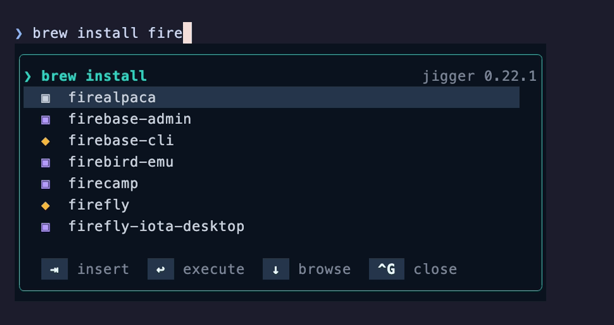
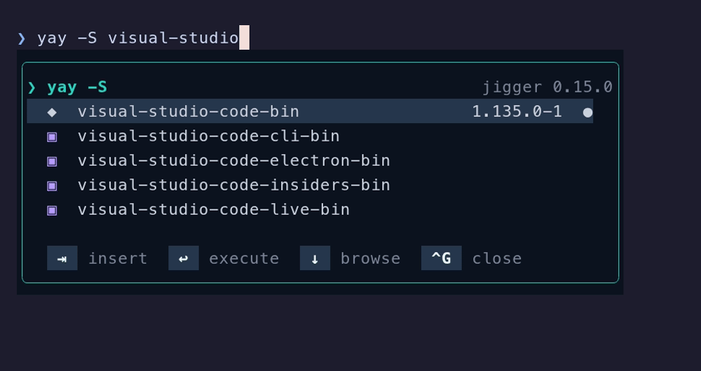
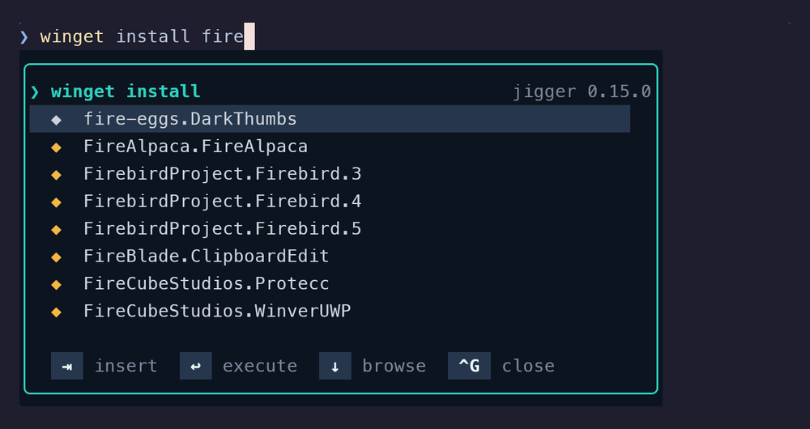

# Installer jigger, de bout en bout

*Ce document existe aussi en [anglais](../installation.md).*

Trois procédures clé en main — une par plateforme — d'une machine qui n'a jamais entendu
parler de jigger jusqu'au popup qui répond sous le prompt. Chacune est **autonome** :
aucun renvoi, rien à lire ailleurs, on colle du haut vers le bas.

Pour comprendre ce qu'on tape à mesure qu'on le tape, lire plutôt les
[Premiers pas](getting-started.md) : ils couvrent le même terrain et expliquent pourquoi.
Cette page-ci est pour quand on veut simplement que ça marche.

| | Durée | Compile ? | Demande |
|---|---|---|---|
| [macOS](#macos) | ~3 min | oui, via le tap | Homebrew, zsh |
| [Omarchy / Arch](#omarchy--arch-linux) | ~2 min | oui | Go, zsh, pacman ou yay |
| [Windows](#windows) | ~2 min | non | scoop, PowerShell 7 |

---

## macOS

**Homebrew, zsh, et les complétions de `brew`.**

### 1. Installer

```sh
brew tap yves/cocktails https://gitlab.yg-devworks.com/yves/homebrew-cocktails.git
brew install jigger
```

Le tap est hébergé sur le GitLab du projet, d'où l'URL explicite. La formule compile le
binaire (`go` vient en dépendance de compilation et repart ensuite), installe le greffon
zsh sous `share/`, et met en place `brew jigger …`.

### 2. Brancher le greffon

```sh
echo 'source "$(brew --prefix jigger)/share/jigger/jigger.plugin.zsh"' >> ~/.zshrc
exec zsh
```

L'ordre des `source` dans `~/.zshrc` n'a pas d'importance — le greffon se place de
lui-même là où il doit être dans les crochets de zsh.

### 3. Vérifier

```sh
jigger --version          # → jigger 0.19.0, ou plus récent
which -a jigger           # exactement une ligne : deux binaires sur le PATH, c'est
                          # la panne la plus pénible à diagnostiquer
```

Puis taper — sans rien presser — `brew install fire`. Le cadre arrive tout seul :



`↓` entre dans la liste, `⇥` insère, `⏎` insère et exécute, `^G` ferme.

### 4. Facultatif — le bloc de prompt

La version de Homebrew et les mises à jour en attente, dans le prompt, comptées en
arrière-plan :

```sh
# oh-my-posh : fondre shell/oh-my-posh/brew.segment.json dans le thème
# starship   : ajouter shell/starship/brew.toml à ~/.config/starship.toml
```

Importer jigger **après** oh-my-posh ou starship dans `~/.zshrc`.

### Le retirer

```sh
brew uninstall jigger && brew untap yves/cocktails
# puis retirer la ligne « source » de ~/.zshrc
```

---

## Omarchy / Arch Linux

**pacman et yay, zsh.** Il n'existe **aucun paquet jigger** — ni dans les dépôts, ni dans
l'AUR — la route est donc Go. Ce n'est pas une route au rabais : jigger n'a aucune
dépendance d'exécution en dehors des gestionnaires eux-mêmes.

### 1. Installer

```sh
sudo pacman -S --needed go git zsh
go install gitlab.yg-devworks.com/yves/jigger@latest
```

Le binaire arrive dans `$GOBIN`, `~/go/bin` par défaut. Le mettre sur le `PATH` s'il n'y
est pas :

```sh
grep -q 'go/bin' ~/.zshrc || echo 'export PATH="$HOME/go/bin:$PATH"' >> ~/.zshrc
```

### 2. Brancher le greffon

Le greffon n'est pas dans le module Go — il vient du dépôt :

```sh
git clone https://gitlab.yg-devworks.com/yves/jigger.git ~/git/jigger
echo 'source ~/git/jigger/shell/jigger.plugin.zsh' >> ~/.zshrc
exec zsh
```

Garder le clone : `git -C ~/git/jigger pull` met le greffon à jour, `go install …@latest`
met le binaire. Les deux voyagent ensemble — le greffon refuse de se charger contre un
binaire antérieur à 0.11.0, et le dit.

### 3. Vérifier

```sh
jigger --version          # → jigger 0.19.0, ou plus récent
which -a jigger           # exactement une ligne
```

Puis taper — sans rien presser — `yay -S visual-studio`. Le cadre arrive tout seul, `◆`
pour un paquet des dépôts, `▣` pour un paquet de l'AUR, `●` pour ce qui est déjà
installé :



**pacman et yay sont deux portes sur la même base**, aussi `jg` liste-t-il vos paquets une
fois et non deux. yay pilote, pacman ne fait que lire
([ADR-0007](../adr/0007-pacman-lit-yay-pilote.md)) — c'est ce qui explique que
`jg install --pm pacman` n'existe pas tant que yay est installé.

### 4. Facultatif — le bloc de prompt

```sh
# oh-my-posh : fondre shell/oh-my-posh/pacman.segment.json dans le thème
# starship   : ajouter shell/starship/pacman.toml à ~/.config/starship.toml
```

### Le retirer

```sh
rm ~/go/bin/jigger && rm -rf ~/git/jigger
# puis retirer la ligne « source » de ~/.zshrc
```

---

## Windows

**winget et scoop, PowerShell 7.** Rien ne compile : les versions publiées portent des
binaires précompilés.

### 1. Installer

```powershell
scoop bucket add jigger https://gitlab.yg-devworks.com/yves/scoop-jigger.git
scoop install jigger
```

`scoop bucket add` prend **deux** arguments — le nom local qu'on choisit, puis le dépôt.
N'en passer qu'un fait chercher à scoop dans son propre annuaire de buckets connus, et il
répond `unknown bucket`.

### 2. Brancher le module

Le bucket n'installe que le **binaire**. Le module — la partie qui dessine le popup —
vient du dépôt :

```powershell
git clone https://gitlab.yg-devworks.com/yves/jigger.git $HOME\git\jigger
Add-Content $PROFILE "`nImport-Module $HOME\git\jigger\shell\jigger.psm1"
. $PROFILE
```

Si `$PROFILE` n'existe pas encore : `New-Item -ItemType File -Path $PROFILE -Force`.

**Une contrainte d'ordre, et celle-là est réelle :** avec oh-my-posh ou starship,
importer jigger **après**.

### 3. Vérifier

```powershell
jigger --version              # → jigger 0.19.0, ou plus récent
Get-Command jigger -All       # exactement une ligne
```

Puis taper — sans rien presser — `winget install fire`. Le cadre arrive tout seul, `◆`
pour un paquet du catalogue, `▣` pour une application détectée en dehors.



### 4. Si vous utilisez `^R`, `^U` ou d'autres touches qui prennent l'écran

PSReadLine ne garde que le **dernier** gestionnaire lié à un accord : un profil qui lie
`^R` après l'import reprend la touche, et la bascule regex devient inatteignable. Lui
proposer la touche d'abord — il dit s'il la veut :

```powershell
Set-PSReadLineKeyHandler -Chord Ctrl+r -ScriptBlock {
    if (Invoke-JiggerRegex) { return }   # $true : le popup l'a prise
    Invoke-FzfHistory                    # $false : la touche est à vous
}
```

Les touches qui prennent l'écran et rendent la ligne veulent `Update-JiggerPopup` ensuite,
sans quoi le cadre reste en place, périmé ou orphelin :

```powershell
Set-PSReadLineKeyHandler -Chord Ctrl+u -ScriptBlock {
    yazi
    [Microsoft.PowerShell.PSConsoleReadLine]::InvokePrompt()
    Update-JiggerPopup
}
```

L'appeler sans aucune précaution : hors d'une ligne de gestionnaire il efface le cadre et
rend la main, et il ne lève jamais rien.

### 5. Facultatif — le bloc de prompt

```powershell
# oh-my-posh : fondre shell\oh-my-posh\windows.segment.json dans le thème
# starship   : ajouter shell\starship\windows.toml au starship.toml
```

### Le retirer

```powershell
scoop uninstall jigger ; scoop bucket rm jigger
Remove-Item -Recurse $HOME\git\jigger
# puis retirer la ligne Import-Module de $PROFILE
```

---

## Commun aux trois

### Choisir les commandes qui déclenchent le popup

`JIGGER_COMMANDS` décide, dans les deux shells. `jigger` et `jg` sont toujours ajoutés.

```sh
JIGGER_COMMANDS='brew pacman ssh'                   # ~/.zshrc, avant le source
```
```powershell
$env:JIGGER_COMMANDS = 'winget,scoop,ssh,scp,sftp'  # $PROFILE, avant l'import
```

C'est aussi ainsi qu'on éteint le [sélecteur SSH](ssh.md) — en retirant `ssh`, `scp` et
`sftp` de la liste.

### Quand ça ne marche pas

| Symptôme | Cause, le plus souvent |
|---|---|
| Aucun cadre, jamais | deux binaires sur le `PATH` ; vérifier par `which -a jigger` |
| Le cadre apparaît une fois, puis plus jamais | le terminal ne répond pas assez vite à l'interrogation du curseur ; le greffon éteint le popup vivant pour la session, et `⇥` reste disponible |
| Le cadre est tronqué | terminal sous 30 colonnes (`JIGGER_MIN_COLUMNS`) |
| `^R` ne fait rien (Windows) | un autre gestionnaire a pris l'accord — voir le § 4 ci-dessus |
| Le greffon dit le binaire trop ancien | `brew upgrade jigger`, `go install …@latest`, ou `scoop update jigger` |

Les [Premiers pas § 9](getting-started.md#9-quand-ça-ne-marche-pas) vont plus loin.
