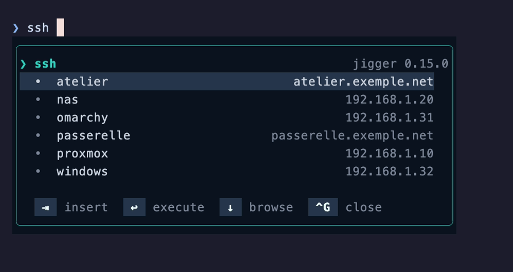
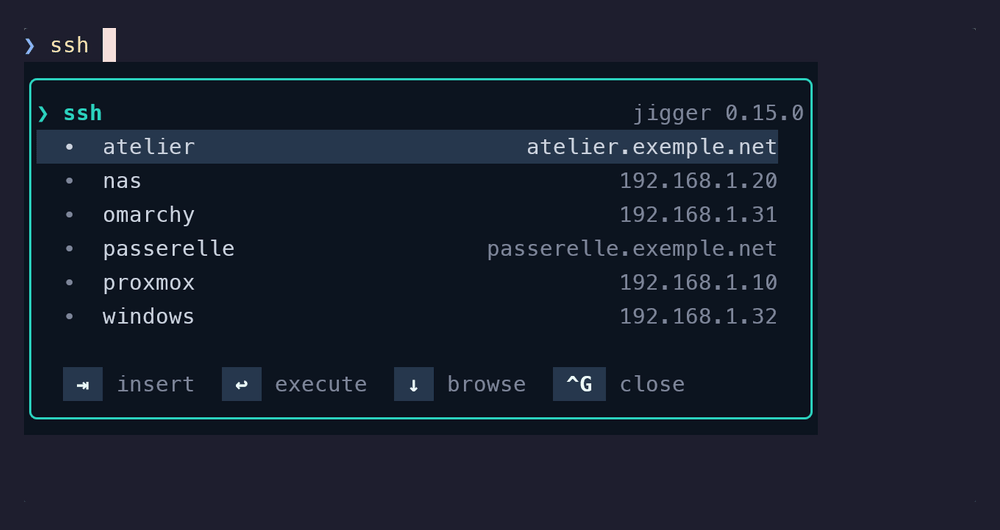

# Le sélecteur SSH

*Ce document existe aussi en [anglais](../ssh.md).*

On tape `ssh ` et le popup propose les serveurs du `~/.ssh/config`, chacun avec son
adresse en regard. `⇥` insère celui qu'on visait.



La même liste, le même `~/.ssh/config`, sous Windows — où rien de ce qui touche à SSH
n'est propre à la plateforme non plus :



C'est le même popup, les mêmes touches et le même cadre que pour `brew` ou `winget` —
seul le catalogue change. C'est tout le propos :
[l'ADR-0005](../adr/0005-completion-sans-facade.md) dit que le contrat de complétion
n'est pas réservé aux gestionnaires de paquets, et `ssh` en est la preuve. Rien dans le
popup ne sait qu'il regarde des serveurs plutôt que des paquets.

## Ce qu'il complète

Trois commandes, et ce sont trois fournisseurs distincts plutôt qu'un seul à trois noms :
`ssh`, `scp` et `sftp`.

Aucune n'a de verbe. `brew install fire` a besoin de sa sous-commande avant que le
catalogue veuille dire quelque chose ; `ssh ` non — l'opérande vient juste après le nom de
la commande, et les serveurs paraissent donc **sur l'espace**, sans que rien d'autre soit
tapé.

### `scp` colle un deux-points

Choisir `nas` derrière `scp` insère `nas:`, deux-points attaché. Ce n'est pas cosmétique :

```sh
scp rapport.pdf nas /tmp        # copie vers un fichier LOCAL nommé « nas »
scp rapport.pdf nas:/tmp        # copie vers le serveur
```

La première commande est valide, silencieuse, et fait la mauvaise chose. `scp` a donc le
deux-points, et les deux autres ne l'ont pas.

## Ce qu'il lit

`~/.ssh/config`, et rien d'autre. Ni `known_hosts`, ni `/etc/ssh/ssh_config`, ni le
réseau — jigger n'ouvre jamais de connexion, et ne demande jamais rien à un serveur.

- **Les directives `Include` sont suivies**, résolues depuis le répertoire du fichier qui
  inclut. Une configuration qui s'inclut elle-même ne fige pas le popup en pleine frappe :
  le lecteur se souvient d'où il est passé.
- **Les motifs sont écartés.** Un nom contenant `*`, `?` ou `!` n'est pas un serveur —
  `Host *`, `Host *.interne`, `Host !build` — et le proposer insérerait quelque chose à
  quoi on ne peut pas se connecter.
- **Le `HostName` est montré** à droite, quand il diffère du nom. C'est ce qui permet de
  distinguer deux hôtes aux noms courts.
- **Un bloc `Match` ferme le bloc `Host` qui le précède.** Ses mots-clés ne s'appliquent à
  aucun des motifs de celui-ci. jigger n'évalue **pas** les conditions d'un `Match` —
  réimplémenter les règles d'OpenSSH ferait un second SSH, subtilement différent ; il
  s'arrête à ne pas attribuer un `HostName` à un hôte qui n'en a pas.

Tout est relu à chaque frappe. Pas de cache, pas de préchauffage : lire quelques fragments
de configuration coûte une milliseconde. SSH est l'un des deux fournisseurs de jigger qui
n'ont rien à tenir — scoop est l'autre, pour une autre raison : son catalogue est déjà
étalé sur le disque, un manifeste par paquet, et le lire coûte moins cher que le mettre
en cache.

## Quand il ne montre rien

**Sur une machine sans `~/.ssh/config`, rien n'apparaît du tout** — pas de popup, pas de
boîte vide, pas de « aucun candidat ». Idem quand rien ne correspond à ce qu'on a tapé.

C'est une règle délibérée ([ADR-0006](../adr/0006-silence-sur-catalogue-vide.md)) : un
fournisseur au catalogue vide ne fait dessiner aucun cadre. Sans elle, quiconque n'a pas
de configuration SSH verrait une boîte apparaître sous chaque frappe de chaque ligne
`ssh`, pour ne rien dire. Les greffons connaissent le protocole — une réponse d'une seule
ligne vaut « rien à afficher » — et effacent ce qui restait.

## L'éteindre

`JIGGER_COMMANDS` décide des commandes qui déclenchent le popup. En retirer les trois et
le sélecteur disparaît :

```sh
JIGGER_COMMANDS='brew pacman'                # ~/.zshrc, avant le source
```
```powershell
$env:JIGGER_COMMANDS = 'winget,scoop'        # $PROFILE, avant l'import
```

`jigger` et `jg` sont toujours ajoutés, quoi que dise la liste.

## Ce qu'il ne fait pas

- **Il n'exécute jamais `ssh`.** Il complète la ligne qu'on exécutera soi-même. Pas
  d'enveloppe, pas de `-o` injecté, pas d'agent touché.
- **Il ne complète pas les chemins distants.** `scp fichier nas:` pose le deux-points et
  s'arrête là ; la suite est à taper.
- **Il ne complète pas les options.** `ssh -` ne propose rien — les gestionnaires de
  paquets déclarent leurs options, `ssh` non.
- **Il ne lit pas `known_hosts`.** Un serveur auquel on s'est connecté une fois, mais
  jamais déclaré, n'est pas un serveur que jigger connaît.
