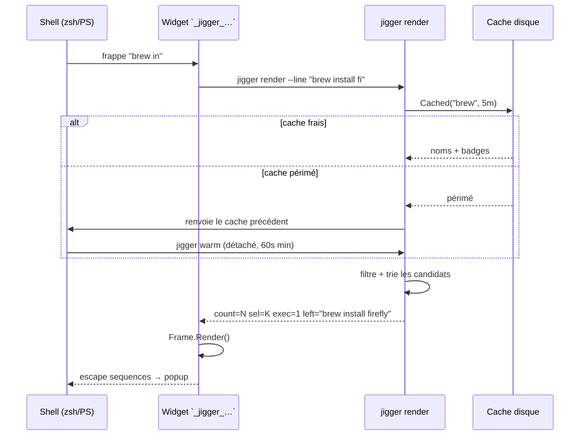
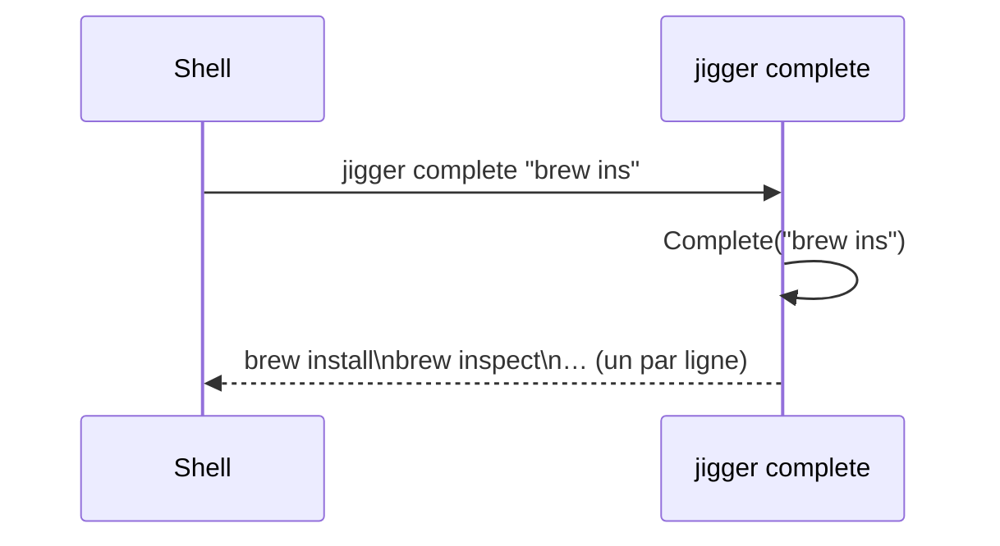
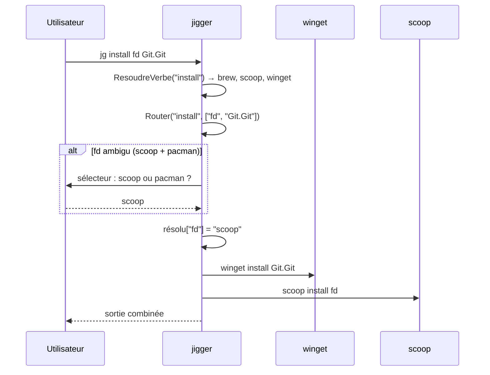
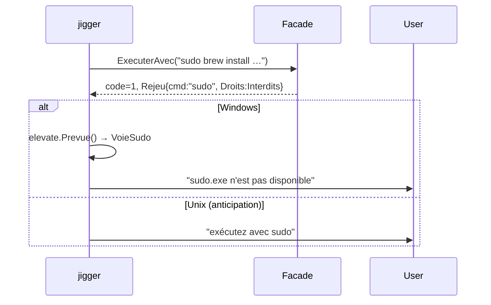

# État du projet jigger

**Généré le** 2026-09-04 — vue d'ensemble architecturale et fonctionnelle.

---

## 1. Présentation

**jigger** est une assistance aux gestionnaires de paquets dans le terminal : complétion
contextuelle et sélecteur interactif, branchés directement dans le shell utilisateur.
Écrit en **Go** (v1.26.5), binaire unique (~3–4 Mo), démarrage < 8 ms.

| Plateforme | Shell | Gestionnaires |
|---|---|---|
| macOS, Linux | zsh (`shell/jigger.plugin.zsh`) | Homebrew |
| Arch Linux | zsh | pacman, yay (AUR) |
| Windows | PowerShell (`shell/jigger.psm1`) | winget, scoop |
| toutes | les deux | ssh / scp / sftp |

Le premier mot de la ligne décide du gestionnaire ; tout ce qui suit est complété via le
même popup [Bubble Tea] / [Lip Gloss]. ⇥ insère, ↩ exécute. Rien n'est jamais lancé à
la place de l'utilisateur — jigger ne fait que composer la ligne.

---

## 2. Structure du dépôt

```
jigger/
├── main.go                  # point d'entrée — CLI, routage vers les sous-commandes
├── tty.go                   # accès /dev/tty (Unix)
├── tty_unix.go              # helpers Unix (pty, terminal size)
├── tty_windows.go           # helpers Windows (ConPTY)
├── config_cli.go            # sous-commande `config` — lecture/export du fichier
├── internal/
│   ├── pm/                  # contrat commun : Manager, Catalog, Verb, Binding
│   ├── facade/              # moteur de syntaxe unique (routage, exécution, formatage)
│   ├── ui/                  # popup, tableau paginé, modèle Bubble Tea
│   ├── complete/            # moteur de complétion (filtre, tri, insertion)
│   ├── managers/            # registry des gestionnaires disponibles
│   ├── config/              # configuration : fichier, vars d'environnement, défauts
│   ├── i18n/                # internationalisation (catalogues FR/EN)
│   ├── elevate/             # élévation de privilèges (sudo Windows, hint Unix)
│   ├── prompt/              # bloc oh-my-posh / starship (cache d'état)
│   ├── brew/                # gestionnaire Homebrew
│   ├── winget/              # gestionnaire winget (Windows)
│   ├── scoop/               # gestionnaire scoop (Windows)
│   ├── pacman/              # gestionnaire alpm (pacman + yay/AUR)
│   └── ssh/                 # complétion SSH/scp/sftp depuis ~/.ssh/config
├── shell/                   # greffons zsh et PowerShell, configs oh-my-posh / starship
├── website/                 # site de documentation (Jekyll-like statique)
├── packaging/               # winget manifest, AUR PKGBUILD
├── tools/miroir/            # utilitaire interne de capture de catalogue
├── tests/                   # harness : smoke, pty, golden, captures
├── docs/                    # ADR, specs, plans, historique, media
└── .gitlab-ci.yml           # pipeline CI (test + build)
```

**Total** : ~14 000 lignes Go dans `internal/`, ~2 500 dans les fichiers de tête.
Pas de dépendance externe lourde — seulement la pile Bubble Tea et quelques utilitaires.

---

## 3. Architecture

### 3.1 Contrats fondamentaux (`internal/pm`)

Le cœur du projet repose sur deux interfaces :

```
┌─────────────────────────┐
│   pm.Manager            │  ← "répondre à des questions"
│   ├─ Cmd() string       │     (complétion)
│   ├─ Subcommands()      │
│   ├─ Options(sub)       │
│   ├─ InstalledOnly(sub) │
│   ├─ Available() bool    │
│   ├─ Load() *Catalog    │  ← lecture cache uniquement
│   ├─ Insert(...) string │
│   └─ Warm(Scope) error  │  ← travail lent, hors chemin critique
├─────────────────────────┤
│   pm.Bindings           │  ← "savoir agir" (optionnel)
│   ├─ Verbs() map       │
│   └─ Binding            │
│       ├─ Native []string│     gabarit argv natif
│       ├─ Build func     │     argv calculé
│       └─ Direct func    │     sans sous-processus
└─────────────────────────┘
```

Cinq gestionnaires implémentent ces contrats : **brew**, **winget**, **scoop**, **pacman**
(et yay, partagé avec pacman), **ssh**. Chaque module dans `internal/<nom>/` contient :

- `*<nom>.go` — la structure `Manager` et `Available()`
- `catalog.go` / `parse.go` — parsing de la sortie du gestionnaire
- `verbs.go` — table `Binding{}` pour chaque verbe supporté
- `_test.go` — tests sur fichiers (zéro processus)

### 3.2 Moteur de façade (`internal/facade`)

La façade est **purement déclarative** : elle ne connaît aucun gestionnaire en particulier.
Elle lit les tables `Bindings` pour résoudre une ligne de commande arbitraire :

```
jg install fd Git.Git
│     │    │  └── winget (seul à connaître Git.Git)
│     │    └── scoop (connaît fd, mais seul — route direct)
│     └── verbe "install" → pool=Catalogue
└── premier mot → détecte le gestionnaire par défaut
```

Pipeline : **résoudre le verbe** → **résoudre chaque nom** (avec désambiguïsation)
→ **exécuter** → **formater**. Aucune logique de gestionnaire n'y vit.

### 3.3 Popup et UI (`internal/ui`)

Le popup est un modèle Bubble Tea sans état : `render` reçoit tout par flags CLI,
rend le cadre, et rend la main. Le sélecteur `pick` est le seul à maintenir un état TUI complet.

### 3.4 Cache et réchauffement (`internal/pm`)

```
jigger render  ──frappe──→ cache périmé ? → jigger warm (détaché)
     │                           │
     ↓                           ↓
  lit le cache              reconstruit les listes
                              (lent, verrouillé)
```

Un verrou fichier (`warm.lock`) empêche les rafales. La stamp (`warm.stamp`) espace
de 60 s les lancements détachés. Le cache vit dans `$JIGGER_CACHE_DIR` ou
`~/.cache/jigger` / `%LOCALAPPDATA%\jigger`.

### 3.5 Configuration (`internal/config`)

Préséance stricte : **défaut** ← **fichier** (`$XDG_CONFIG_HOME/jigger/config.toml`
ou `~/.config/jigger/config.toml`) ← **variables d'environnement**.
Les greffons ne lisent jamais le fichier — ils demandent au binaire via `jigger config --export`.

---

## 4. Workflows

### 4.1 Flux principal : popup en temps réel



### 4.2 Flux de complétion native



### 4.3 Flux d'exécution (façade multi-gestionnaires)



### 4.4 Flux de réchauffement (warm)

```mermaid
flowchart LR
    subgraph Détaché
        W1[jigger warm] --> L{verrou ?}
        L -->|pris| X[rendez-vous 0, autre fait le travail]
        L -->|libre| C1[boucle managers.Available()]
        C1 --> W2[m.Warm(ScopeStale)]
        W2 --> F{succès ?}
        F -->|non| E[message stderr]
        F -->|oui| S[Store() cache]
    end

    Main[jigger render] --> CC{cache frais ?}
    CC -->|oui| R1[utilise le cache]
    CC -->|non| CT[renvoie le cache précédent]
```

### 4.5 Flux d'élévation de privilèges



---

## 5. Tests

| Suite | Cible | Commande |
|---|---|---|
| `go test ./...` | Unité + intégration légère | `make test` |
| `test-shell` | Widget zsh en vrai pty | `make test-shell` |
| `test-golden` | Rendu pixel-perfect (macOS) | `./tests/render-golden.sh --verifier` |
| `test-shell-ps` | Module PowerShell (sans console) | `make test-shell-ps` |
| `test-pty` | Popup en ConPTY Windows | `make test-pty` |

Les tests de parsing (`*_test.go` dans chaque gestionnaire) sont **purs** : ils alimentent
le parser avec du texte brut et vérifient la sortie. Aucun processus n'est lancé.

---

## 6. Points d'extension existants

| Extension | Comment | Limite actuelle |
|---|---|---|
| Nouveau gestionnaire | Créer `internal/<nom>/` avec Manager + Bindings | Recompile nécessaire |
| Nouvelle langue | Ajouter catalogue dans `internal/i18n/` | — |
| Nouveau verbe | Ajouter entrée dans `Binding{}` | — |
| Plugin tiers (futur) | Protocole sous-processus JSON (ADR-0001) | Non implémenté |

---

## 7. ADRs

| Numéro | Titre | Date |
|---|---|---|
| 0001 | Go confirmé comme stack | 2026-08-15 |
| 0002 | Facade table declarative | 2026-08-15 |
| 0003 | Fichier de configuration | 2026-08-15 |
| 0004 | Elevation constatée | 2026-08-16 |
| 0005 | Completion sans facade | 2026-08-16 |
| 0006 | Silence sur catalogue vide | 2026-08-16 |
| 0007 | pacman lit yay pilote | 2026-09-03 |

---

## 8. Statut de version

**Version courante : 0.15.0** — fonctionnelle sur les trois plateformes, avec la façade
multi-gestionnaires, l'élévation Windows, le sélecteur SSH/scp/sftp, et le site de
documentation.

[Bubble Tea]: https://github.com/charmbracelet/bubbletea
[Lip Gloss]: https://github.com/charmbracelet/lipgloss
