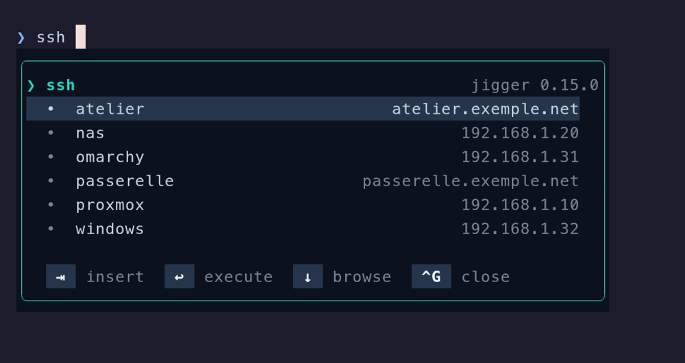

# The SSH picker

*Read this in [French](fr/ssh.md).*

Type `ssh ` and the popup offers the servers of your `~/.ssh/config`, each with its
address alongside. `⇥` inserts the one you're after.


The same list, the same `~/.ssh/config`, on Omarchy and on Windows — where nothing about
SSH is platform-specific either:




It is the same popup, the same keys and the same frame as for `brew` or `winget` — only
the catalogue changes. That is the whole idea:
[ADR-0005](adr/0005-completion-sans-facade.md) says the completion contract is not
reserved for package managers, and `ssh` is what proves it. Nothing in the popup knows
it is looking at servers rather than packages.

## What it completes

Three commands, and they are three separate providers rather than one with three names:
`ssh`, `scp` and `sftp`.

None of them has a verb. `brew install fire` needs its subcommand before the catalogue
means anything; `ssh ` does not — the operand comes straight after the command name, so
the servers appear **on the space**, with nothing else typed.

### `scp` inserts a colon

Picking `nas` behind `scp` inserts `nas:`, colon attached. This is not cosmetic:

```sh
scp rapport.pdf nas /tmp        # copies to a LOCAL file named “nas”
scp rapport.pdf nas:/tmp        # copies to the server
```

The first command is valid, silent, and does the wrong thing. So `scp` gets the colon
and the other two don't.

## What it reads

`~/.ssh/config`, and nothing else. No `known_hosts`, no `/etc/ssh/ssh_config`, no
network — jigger never opens a connection, and never asks a server anything.

- **`Include` directives are followed**, resolved from the directory of the file doing
  the including. A configuration that includes itself does not hang the popup mid-keystroke;
  the reader remembers where it has been.
- **Patterns are left out.** Any name containing `*`, `?` or `!` is not a server —
  `Host *`, `Host *.internal`, `Host !build` — and offering it would insert something
  that cannot be connected to.
- **`HostName` is shown** to the right, when it differs from the name. That is how you
  tell two hosts apart when the names are short.
- **A `Match` block closes the `Host` block before it.** Its keywords apply to none of
  that block's patterns. jigger does **not** evaluate `Match` conditions — reimplementing
  OpenSSH's rules would be a second, subtly different SSH; it stops at not attributing a
  `HostName` to a host that does not have one.

Everything is re-read on every keystroke. There is no cache and no warm-up: reading a
few fragments of configuration costs a millisecond. SSH is not alone in having nothing
to keep — scoop doesn't either, for a different reason: its catalogue is already laid
out on disk, one manifest per package, so reading it costs less than caching it.

## When it shows nothing

**On a machine with no `~/.ssh/config`, nothing appears at all** — no popup, no empty
box, no "no candidates". Same when nothing matches what you typed.

That is a deliberate rule ([ADR-0006](adr/0006-silence-sur-catalogue-vide.md)): a
provider with an empty catalogue draws no frame. Without it, anyone with no SSH
configuration would see a box appear under every keystroke of every `ssh` line, to say
nothing. The plugins know the protocol — a single-line answer means "nothing to show" —
and erase whatever was left over.

## Turning it off

`JIGGER_COMMANDS` decides which commands trigger the popup. Drop the three and the
picker is gone:

```sh
JIGGER_COMMANDS='brew pacman'                # ~/.zshrc, before the source
```
```powershell
$env:JIGGER_COMMANDS = 'winget,scoop'        # $PROFILE, before the import
```

`jigger` and `jg` are always added, whatever the list says.

## What it does not do

- **It never runs `ssh`.** It completes the line you will run yourself. There is no
  wrapper, no `-o` injected, no agent touched.
- **It does not complete remote paths.** `scp file nas:` inserts the colon and stops
  there; what follows is yours to type.
- **It does not complete options.** `ssh -` offers nothing — the package managers
  declare their options, `ssh` does not.
- **It does not read `known_hosts`.** A server you have connected to once, but never
  declared, is not a server jigger knows.
